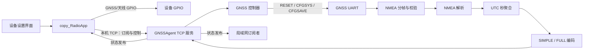

# GNSSAgent 需求说明与系统设计

> **状态：已作废。** 本文的串口直连与控制架构不再适用。自 2026-08-24 起，现行需求以 [`GNSSAgent-Requirements.md`](./GNSSAgent-Requirements.md) 为唯一基线。

- 文档版本：1.2
- 协议版本：1
- 日期：2026-08-02
- 状态：已完成需求与协议复核，可进入实施计划
- 对外协议：[`GNSSAgent-Binary-Protocol-v1.md`](../../protocol/GNSSAgent-Binary-Protocol-v1.md)

## 1. 背景

现有 `copy_RadioApp` 同时承担电台业务与 GNSS 串口访问。为消除串口竞争、集中 GNSS 解析并向多个业务提供统一数据，需要新增独立服务 `GNSSAgent`。

`GNSSAgent` 独占 GNSS UART，读取原始 NMEA，完成校验、解析和每秒聚合，通过 TCP 自定义二进制协议向本机或局域网消费者发布精简版或完全版状态。同时，它接收本机 `copy_RadioApp` 发出的 GNSS 开关/星座模式通知，并执行必须通过 GNSS UART 完成的模块命令。

## 2. 建设目标

1. 将 GNSS UART 从 `copy_RadioApp` 中完全剥离，由 `GNSSAgent` 单独读写。
2. 支持 GPS、北斗、GPS+北斗三种设备模式下的 NMEA 输出。
3. 将同一 GNSS UTC 秒内的数据聚合为最多一条状态消息，而不是逐句转发 NMEA。
4. 同时提供精简状态和完全状态，订阅者在订阅时选择一种格式。
5. 对外只使用固定布局的自定义二进制协议，不使用 Protobuf，不传输原始 NMEA。
6. 允许 `copy_RadioApp` 在同一条 TCP 连接上完成订阅和控制，不额外维护控制连接。
7. 一套 Go 源码面向 CCU、HF、MultibandRadio、MultibandHandheld 生成对应可执行程序。

## 3. 范围

### 3.1 本期包含

- GNSS UART 打开、配置、独占访问、断线重试。
- NMEA 分帧、校验和校验、字段解析。
- RMC、GGA、GSA、GSV、GST 数据聚合。
- GPS、北斗、GLONASS、Galileo 的可见卫星数量统计。
- 使用中卫星的平均 C/N0 计算。
- TCP 订阅、状态发布、开关/模式控制及 ACK。
- 二进制协议流式解帧和错误重同步。
- 目标设备交叉编译与 SysV 服务运行方式。

### 3.2 本期不包含

- 单颗卫星的编号、方位角、仰角和 C/N0 对外上报。
- Protobuf、JSON 或文本协议。
- 应用层 CRC、心跳消息、通用 `ERROR` 消息。
- TLS、鉴权、访问令牌。
- GNSS 1PPS 接入。
- 修改本机系统时间。
- `device_id`、`antenna_id`、`antenna_status`。
- 推导后的 `horizontal_accuracy`、`vertical_accuracy`。
- 独立的 RESET 控制消息。
- `GNSSAgent-CCU-Audio` 构建产物。

## 4. 系统边界与职责



### 4.1 `copy_RadioApp` 职责

- 保留设置界面及设备配置持久化。
- 保留 `GPS_En_GPIO`、`GPS_ANT_En_GPIO`、`GPS_ANT_En2_GPIO` 等设备专用 GPIO 控制。
- 不再打开、读取或写入 GNSS UART。
- 设备开关或 Type 发生真实用户操作时，向 `GNSSAgent` 发送 `GNSS_SWITCH_REQ`。
- TCP 断开后自动重连并重新订阅；重连本身不得重发开关状态、Type 或触发模块复位。
- 完整设备启动时，保存的 Type 与设备实际模式是否需要重新同步，由 `copy_RadioApp` 的启动逻辑决定；普通 TCP 重连不执行该同步。
- 现有 ZDA 授时路径不得继续直接依赖 GNSS UART。若 `copy_RadioApp` 保留本机授时功能，应改为订阅本协议的 `utc_time`/`recv_time`，并接受首次得到带日期 RMC 之前 `utc_time` 无效。

### 4.2 `GNSSAgent` 职责

- 独占 GNSS UART，执行全部串口收发。
- 对实际收到的 NMEA 进行解析，不把保存的 UI Type 当作解析依据。
- 执行 `$RESET`、`$CFGSYS`、`$CFGSAVE`。
- 维护每秒聚合状态并按订阅格式编码。
- 向本机及可信局域网发布 GNSS 状态。
- 只接受来自 `127.0.0.1` 的控制请求。
- 没有读到 NMEA 时保持静默，不伪造“无数据”状态。

## 5. 运行环境与构建

### 5.1 实现语言

- 使用 Go。
- `go.mod` 语言基线为 Go 1.23，源码不得依赖 Go 1.24 及以上才提供的语言或标准库能力。
- `CGO_ENABLED=0`，生成无 CGO 依赖的单文件可执行程序。
- 构建参数包含 `-trimpath` 和链接参数 `-s -w`。

### 5.2 构建矩阵

| 产物 | Go 工具链 | GOOS | GOARCH | 补充参数 |
|---|---:|---|---|---|
| `GNSSAgent-CCU` | 1.25.5 | linux | amd64 | 无 |
| `GNSSAgent-HF` | 1.23.12 | linux | arm | `GOARM=7` |
| `GNSSAgent-MultibandRadio` | 1.25.5 | linux | arm64 | `GOARM64=v8.0` |
| `GNSSAgent-MultibandHandheld` | 1.25.5 | linux | arm | `GOARM=7` |

构建方式参考 `D:\CPD\CPDC`。目标类型通过链接参数写入构建信息，运行期据此加载目标默认值。

### 5.3 运行参数

| 参数 | MultibandRadio 默认值 | 说明 |
|---|---:|---|
| serial device | `/dev/ttyUL4` | GNSS UART |
| baud | `9600` | 当前设备参数，8N1、无流控；须通过有定位链路预算验收 |
| listen | `0.0.0.0:29501` | TCP 监听地址 |
| max connections | `5` | 最大 TCP 总连接数，包含尚未订阅的连接 |
| max remote connections | `4` | 非环回连接上限，为本机控制连接保留至少 1 个总连接名额 |

其他设备在串口号完成硬件确认前不内置猜测值；部署时必须显式提供串口路径，否则服务打印明确错误并以非零状态退出。监听地址、端口、串口路径和波特率均允许通过命令行覆盖。修改波特率时必须同步修改 GNSS 模块和 UART 两端，不能只修改服务参数。

## 6. 串口与 NMEA 输入

### 6.1 串口所有权

- `GNSSAgent` 是 GNSS UART 的唯一所有者。
- `copy_RadioApp` 的改造版本必须在部署 `GNSSAgent` 前释放 `/dev/ttyUL4`。
- 服务启动时打开串口并尝试设置独占标志；打开失败时 TCP 服务仍可运行，串口管理器每 2 秒重试。
- 串口断开或读错误后关闭当前句柄、清空未完成的 NMEA 行，再进入重试。
- 串口不可用期间不发布状态；控制请求返回 `SERIAL_UNAVAILABLE`。
- 串口读取必须使用缓冲区批量读取，禁止沿用每次 `read()` 1 字节的方式；建议读缓冲区不小于 4096 字节。
- 服务按秒统计接收字节数。UART 8N1 链路占用率按 `bytes_per_second × 10 / baud` 计算；任意滚动 1 秒峰值超过 90%，或任意连续 60 秒窗口平均值超过 80% 时分别限频告警。

### 6.2 UART 链路预算

当前无定位实测约 288 B/s；9600 8N1 的理论载荷上限约 960 B/s。真实定位后 GSA/GSV 变长，9600 不能仅凭无定位数据判定为安全。MultibandRadio 发布前必须在真实可见卫星条件下持续测量：

- 记录实际每秒接收字节数、GSV 包数、内核 overrun/frame/parity 错误以及不完整 GSV 周期数。
- 任意连续 60 秒窗口的平均链路占用率不得超过 80%，任意滚动 1 秒窗口的峰值占用率不得超过 90%，且不得出现 UART overrun 或稳定的 GSV 缺包。
- UART 错误计数以对已打开串口 fd 调用 `TIOCGICOUNT` 所得增量为主。驱动不支持该 ioctl 时，验收工具在测试前后读取 `/proc/tty/driver/ttyUL4`；未显示的 overrun/frame/parity 项按 0 记录，同时日志必须明确标记使用了回退口径。
- 超过阈值时，发布前必须提高模块与 UART 两端波特率，或降低 GNSS 模块输出语句/频率；不能依靠解析器容忍丢包通过验收。
- 1.5 秒聚合回退超时只有在上述链路预算通过后才视为已验证配置。

### 6.3 NMEA 分帧

- 语句以 `$` 开始，以 LF 或 CRLF 结束。
- 单条输入上限为 1024 字节；超限语句丢弃，并从下一个 `$` 重新同步。
- 只处理包含 `*HH` 且 XOR 校验和正确的语句。
- 校验失败、字段格式错误、非有限浮点数只影响当前语句，不停止服务。
- 支持常见 talker：`GP`、`BD`/`GB`、`GN`、`GL`、`GA`。

### 6.4 支持的语句

| 语句 | 用途 |
|---|---|
| RMC | UTC 日期与时间、定位有效性、位置、地速、地面航向 |
| GGA | 定位质量、位置、海拔、椭球高度计算、使用卫星数、GGA HDOP、差分龄期 |
| GSA | 2D/3D 状态、使用卫星编号、PDOP/HDOP/VDOP |
| GSV | 各星座可见卫星数及卫星 C/N0，用于计算使用中卫星平均 C/N0 |
| GST | 伪距 RMS 与位置误差椭圆的七个原始统计字段 |

其他标准语句和厂商私有语句在 v1 中忽略。

GST 字段作为跨设备协议能力保留，不能因为当前一个目标不输出就改变 v1 布局。当前 MultibandRadio 固件实测不输出 GST，因此该目标的 FULL 有效位 22–28 预期保持为 0；GST 解析使用构造输入完成单元测试，不把实机产生 GST 作为 MultibandRadio 验收条件。当前模块也不输出 GL/GA 数据，因此 GLONASS/Galileo 计数位 12、13 同样预期为 0；其他目标收到相应数据时仍应正常上报。

## 7. 每秒聚合

1. RMC、GGA、GST 自带 UTC 时分秒，用 UTC 整秒作为聚合周期键。
2. GSA、GSV 没有完整 UTC 时间，按到达顺序附着到当前周期。
3. 新 UTC 秒到达时，完成并发布前一周期。
4. 如果下一秒语句迟迟未到，当前周期在首句到达 1.5 秒后完成。
5. 同一个 UTC 秒最多发布一条状态消息。
6. 同一周期可能收到多条 GSA，例如组合模式下的两条 `GNGSA`；解析器必须合并其使用卫星集合，不能由后一条覆盖前一条。卫星身份和无法确定星座时的处理按 §8.2“卫星统计规则”执行，不允许按 GSA 出现顺序猜测星座。
7. GSV 必须收齐一个星座本周期声明的全部分包后，才能认定该星座计数和相关 C/N0 有效。`GPGSV,1,1,00` 这类声明 1 包且 0 颗卫星的语句属于完整周期，卫星数 0 是有效值。
8. 每个周期重新建立字段和值的有效位，不从上一周期继承缺失字段。
9. 没有任何校验正确的 NMEA 时，不创建周期、不发送状态、不发送应用心跳。
10. NMEA 正常到达但导航解无效时，仍发布本周期状态，并将 `valid` 置为 0。

`recv_time` 是本周期第一条校验正确的 NMEA 被服务读取时的本机 Unix 毫秒时间。它不是服务运行时长，也不是该周期第一条消息的 GNSS 时间。

## 8. GNSS 数据模型

### 8.1 有效性总则

- 完全版和精简版各自拥有独立的 `field_validity_mask`。
- 有效位顺序与对应状态载荷中的业务字段顺序完全一致。
- 位为 1 表示来源字段存在、格式正确且数值可表示；位为 0 表示字段不可用。
- 无效字段的载荷字节统一编码为 0，但消费者不得通过数值是否为 0 判断有效性。
- `0` 可能是合法值，例如 `differential_age=0`、卫星数量为 0、速度为 0 或 `valid=0`。
- `valid` 表示导航解是否可用，与“字段有没有成功解析”是两个概念。
- 时间字段的有效性不依赖位置解是否有效。

### 8.2 完全状态字段

完全状态载荷固定为 124 字节；精确偏移和编码见对外协议文档。

| 位 | 字段 | 类型 | 数据来源 | 字段含义 |
|---:|---|---|---|---|
| 0 | `utc_time` | uint64 | RMC | GNSS UTC，Unix epoch 毫秒 |
| 1 | `recv_time` | uint64 | 本机时钟 | 周期首条正确 NMEA 的接收时刻，Unix epoch 毫秒 |
| 2 | `latitude` | float64 | GGA 优先、RMC 备用 | 纬度，度，北为正、南为负 |
| 3 | `longitude` | float64 | GGA 优先、RMC 备用 | 经度，度，东为正、西为负 |
| 4 | `altitude_msl` | float64 | GGA | 相对平均海平面的海拔，米 |
| 5 | `altitude_ellipsoid` | float64 | GGA | 有效定位下的椭球高，`altitude_msl + geoid_separation`，米 |
| 6 | `valid` | uint8 | RMC、GGA | 导航解是否有效，0/1 |
| 7 | `fix_dimension` | uint8 | GSA | 1=无定位，2=2D，3=3D |
| 8 | `solution_type` | uint8 | GGA | 定位解类型，保留 GGA quality 数值 |
| 9 | `used_satellites` | uint8 | GGA 优先、GSA 备用 | 当前参与定位的卫星总数 |
| 10 | `gps_satellites` | uint8 | 完整 GPS GSV | 可见 GPS 卫星数 |
| 11 | `beidou_satellites` | uint8 | 完整北斗 GSV | 可见北斗卫星数 |
| 12 | `glonass_satellites` | uint8 | 完整 GLONASS GSV | 可见 GLONASS 卫星数 |
| 13 | `galileo_satellites` | uint8 | 完整 Galileo GSV | 可见 Galileo 卫星数 |
| 14 | `gga_hdop` | float32 | GGA | GGA 报告的 HDOP |
| 15 | `gsa_pdop` | float32 | GSA | GSA 报告的 PDOP |
| 16 | `gsa_hdop` | float32 | GSA | GSA 报告的 HDOP |
| 17 | `gsa_vdop` | float32 | GSA | GSA 报告的 VDOP |
| 18 | `differential_age` | float32 | GGA | 差分修正龄期，秒；0 可以有效 |
| 19 | `avg_used_cn0` | float32 | GSA+完整 GSV | 参与定位且有 C/N0 的卫星算术平均值，dB-Hz |
| 20 | `ground_speed_mps` | float32 | RMC | 地速，节换算为米/秒 |
| 21 | `course_over_ground_deg` | float32 | RMC | 地面航向，真北为 0°、顺时针，度 |
| 22 | `gst_pseudorange_rms` | float32 | GST | 伪距残差 RMS，米 |
| 23 | `gst_semi_major_error` | float32 | GST | 误差椭圆半长轴 1σ，米 |
| 24 | `gst_semi_minor_error` | float32 | GST | 误差椭圆半短轴 1σ，米 |
| 25 | `gst_orientation_deg` | float32 | GST | 误差椭圆方向，度 |
| 26 | `gst_latitude_error` | float32 | GST | 纬度方向 1σ 误差，米 |
| 27 | `gst_longitude_error` | float32 | GST | 经度方向 1σ 误差，米 |
| 28 | `gst_altitude_error` | float32 | GST | 高度方向 1σ 误差，米 |

#### `valid` 计算

- RMC 明确报告有效/无效，GGA 通过 quality 是否为 0 报告有效/无效。
- RMC 与 GGA 同时存在时，任意一个明确无效，则 `valid=0`。
- 只存在其中一个时，采用该语句的结论。
- 两者都不存在时，`valid` 的有效位清 0，值编码为 0。
- 即使经纬度字段解析成功，消费者也应同时检查经纬度有效位以及 `valid` 有效位和值。

#### `solution_type` 枚举

| 值 | 含义 |
|---:|---|
| 0 | 无效定位 |
| 1 | 单点定位 |
| 2 | 差分定位，包括 DGNSS/SBAS |
| 3 | PPS/高精度模式，含义依接收机 |
| 4 | RTK fixed |
| 5 | RTK float |
| 6 | 航位推算 |
| 7 | 手工输入 |
| 8 | 仿真模式 |
| 9–255 | 厂商扩展或未知值，原样保留 |

#### 卫星统计规则

- 卫星身份严格按以下优先级确定：① GSA System ID；② 能指明星座的 talker（`GP`、`BD`/`GB`、`GL`、`GA`）；③ 本周期完整 GSV 中仅有一个星座包含该原始 PRN 的唯一匹配；④ 经当前目标实机确认的 PRN 区间映射。没有实机证据时不得写死厂商相关 PRN 区间，也不得按多条 GSA 的出现顺序绑定星座。
- 当前 MultibandRadio 的 `GNGSA` 没有 System ID，首次实现不得假定其中 PRN 的星座。完整 GSV 中同一原始 PRN 同时出现在多个星座时仍为歧义。
- `used_satellites` 优先使用 GGA 数量。GGA 缺失时：已确定星座的卫星按“星座 + PRN”去重；对未确定星座的 GN GSA，先收集所有非空原始 PRN。若每个原始 PRN 只出现一次且不与已确定身份集合中的原始 PRN 重号，则每个槽计为一颗；若某个未确定 PRN 在多条 GSA 中重复，或与已确定集合中的原始 PRN 相同，且不能通过唯一 GSV 匹配消除歧义，则 `used_satellites` 整体无效，不能猜测它是一颗还是多颗卫星。
- GGA 与 GSA 数量冲突时使用 GGA，并记录限频告警。
- 四个星座计数字段表示可见卫星，不表示参与定位的卫星。
- 只有 talker 或卫星编号能明确归属星座时才计数；无法明确归属时对应有效位不置 1。
- `avg_used_cn0` 只统计 GSA 标记为参与定位、身份可唯一关联，并且在本周期完整 GSV 中找到有效 C/N0 的卫星。歧义 PRN 不参与平均；没有唯一匹配项或 GSV 不完整时该字段无效。
- 声明 0 颗卫星且分包完整的 GSV 周期，其星座计数字段有效且值为 0；这不能与 GSV 缺失或缺包混淆。

#### GGA 与 GSA DOP

`gga_hdop` 与 `gsa_hdop` 是两个独立字段，不能互相回填。DOP 的有效性规则如下：

- GGA quality 为 0 时，`gga_hdop` 无效，即使字段文本存在且可解析。
- GSA fix type 为 1 时，该条 GSA 的 PDOP/HDOP/VDOP 无效。
- 当前接收机使用 `127.000` 表示无定位 DOP；任一 DOP 等于 127.000 时，该条 GSA 的三项 DOP 整组无效，GGA 的 127.000 HDOP 也无效。
- 一个周期只有一组完整有效 GSA DOP 时，直接采用该组。
- 一个周期存在多组完整有效 GSA DOP 时，比较值必须直接从 NMEA 十进制字段文本生成，转换过程不得经过 binary32/binary64：按 `.` 拆分整数和小数部分；小数不足 3 位右补 0；超过 3 位时查看第 4 位，第 4 位为 5–9 则把前三位小数表示的整数加 1，并正确处理向整数部分的进位；第 5 位及以后不再影响 half-up 结果。最终得到 `dop_milli = integer_part × 1000 + rounded_fraction_milli`。三项 `dop_milli` 的组间差值都不超过 10（即 0.010，包含边界）时视为一致，并上报本周期第一组有效 GSA DOP 的原始解析值；任一项差值大于 10 时，三项 GSA DOP 全部无效并记录限频告警。不得取最后一条、最小值或平均值。
- 多条 GSA 的 `fix_dimension` 取所有可解析 fix type 的最大值；没有可解析值时该字段无效。
- 本周期没有有效 GSA DOP 时，`gsa_pdop`、`gsa_hdop`、`gsa_vdop` 均无效，但不影响有效的 `gga_hdop`。

#### 高度有效性

- `altitude_msl` 只要 GGA 高度字段存在且有限即可解析，但消费者使用它进行导航时仍必须同时检查总体 `valid`。
- `altitude_ellipsoid` 只有在 GGA quality 大于 0、`altitude_msl` 与 `geoid_separation` 都存在且为有限值时才有效。
- 无定位时模块可能输出 `geoid_separation=0` 作为占位；不得据此生成有效的 `altitude_ellipsoid`。
- 有效定位时 `geoid_separation=0` 可以是合法值，不能仅因为数值为 0 判无效。

#### 时间规则

- `utc_time` 由 RMC 的 UTC 日期和 UTC 时分秒组合为 Unix epoch 毫秒。
- RMC 日期或时间缺失、格式错误时，`utc_time=0` 且有效位清 0。
- GGA/GST 的时分秒只用于关联同一个聚合周期，不能单独构造 Unix 时间。
- RMC 导航状态为无效不必然使 UTC 时间无效；时间字段只按自身能否正确解析判断。
- 当前 MultibandRadio 模块实测不输出 ZDA，且无定位 RMC 的日期字段为空，因此首次得到包含日期的 RMC 之前 `utc_time` 必然无效。这是设备能力，不应由本服务用系统日期或旧日期补齐。
- 本服务只上报时间，绝不调用系统校时接口。

本机消费者如果使用状态消息授时，必须在收到完整状态帧时、修改系统时钟之前，立即记录 `client_recv_time`。时序为：

```text
utc_time → recv_time → client_recv_time → 实际校时
```

其中 `utc_time` 是授时基准；`recv_time` 是 GNSSAgent 收到该周期首条正确语句时的本机系统时间；`client_recv_time` 是消费者收到状态帧时的本机系统时间。每秒聚合和 TCP 传输可能使 `client_recv_time - recv_time` 达到 1～2 秒，因此消费者在消息接收时刻的目标时间为：

```text
target_at_client_receive = utc_time + (client_recv_time - recv_time)
```

如果在记录 `client_recv_time` 后没有立刻校时，还应把“记录后到实际校时”的单调时钟耗时继续加到目标时间。该算法只适用于 GNSSAgent 与消费者位于同一台设备、两者读取同一个系统时钟，且这 1～2 秒内系统时钟没有发生其他跳变的场景；远程消费者的本机时钟与 `recv_time` 不在同一时钟域，不能直接相减。算法可以补偿聚合和本机消息传递延迟，但不能消除 GNSS 测量历元到 NMEA 串口到达之间的接收机内部延迟；更高精度需要 GNSS 1PPS。

### 8.3 精简状态字段

精简状态载荷固定为 58 字节，拥有独立的 0–8 位有效掩码：

| 位 | 字段 | 类型 | 含义 |
|---:|---|---|---|
| 0 | `utc_time` | uint64 | GNSS UTC Unix 毫秒 |
| 1 | `recv_time` | uint64 | 本周期首条正确 NMEA 的本机接收时间 |
| 2 | `latitude` | float64 | 纬度，度 |
| 3 | `longitude` | float64 | 经度，度 |
| 4 | `altitude_msl` | float64 | 海拔，米 |
| 5 | `ground_speed_mps` | float32 | 地速，米/秒 |
| 6 | `course_over_ground_deg` | float32 | 地面航向，度 |
| 7 | `valid` | uint8 | 导航解是否有效，0/1 |
| 8 | `used_satellites` | uint8 | 参与定位卫星总数 |

字段含义和来源规则与完全状态一致，但精简掩码位号不得直接套用完全状态掩码。

## 9. TCP 订阅与发布

- 默认监听 `0.0.0.0:29501`，使用长连接 TCP。
- 服务端最多保留 5 条 TCP 连接，尚未订阅、已订阅和本机控制连接全部计入同一个总上限；其中非环回连接最多 4 条，始终为 `127.0.0.1` 的本机 `copy_RadioApp` 保留至少 1 个总连接名额。
- 客户端连接后必须首先发送 `SUBSCRIBE_REQUEST`，选择 SIMPLE 或 FULL。
- 新连接必须在 5 秒内完成有效订阅，否则服务端关闭连接并释放名额。
- 订阅成功后，服务只发送该连接选择的状态类型。
- 同一连接重复订阅返回 `ALREADY_SUBSCRIBED`；v1 不支持连接内切换格式，客户端如需切换应重连。
- 接受连接后立即按对端地址检查总上限和非环回上限。超限连接不得进入 5 秒订阅等待：服务端不得为读取订阅请求而等待，仅可做一次非阻塞检查；若此时接收缓冲区中已经存在完整合法的 `SUBSCRIBE_REQUEST`，可在不阻塞的前提下返回 `SERVER_FULL`，否则立即关闭。客户端必须同时处理“收到 SERVER_FULL”和“容量已满时直接断开”两种结果。
- `copy_RadioApp` 在成功订阅的同一连接上发送控制请求。
- TCP 断开不影响串口、解析器或聚合器；重连后只重新订阅。
- TCP 可能拆分或合并帧，双方必须按帧头长度进行流式解析。
- 状态频率最高约 1 Hz；没有 NMEA 时没有状态帧，也没有应用心跳。

### 9.1 慢客户端

每个订阅者只保留一个尚未发送的最新状态。新状态到达时可以替换队列中尚未写出的旧状态，避免慢客户端造成内存增长。单次写入超过 3 秒仍未完成时关闭该 TCP 连接；这是传输故障处理，不属于协议格式错误。

## 10. GNSS 控制

### 10.1 访问限制

- `GNSS_SWITCH_REQ` 只允许来自 TCP 对端 `127.0.0.1`。
- 局域网客户端发送控制请求时返回 `GNSS_SWITCH_ACK(FORBIDDEN)`，不执行串口写入。
- 控制请求串行执行；已有请求尚未完成时，新请求返回 `BUSY`。

### 10.2 请求含义

`GNSS_SWITCH_REQ` 包含：

```text
uint32 request_id
uint8  switch
uint8  type
```

- `switch`：0=关闭，1=开启。
- `type`：1=GPS，2=北斗，3=GPS+北斗。
- `request_id` 仅用于请求与响应关联；发送方在同一连接上不得并发复用相同 ID。

### 10.3 与 GPIO 的协作顺序

1. `copy_RadioApp` 先完成真实用户操作要求的 `GPS_En_GPIO` 切换。
2. GPIO 操作成功后发送 `GNSS_SWITCH_REQ`。
3. 关闭请求不向已经断电的 GNSS UART 写命令；`GNSSAgent` 清空未完成聚合周期并返回成功。
4. `GNSSAgent` 记住本进程内最后一次成功处理的开关状态。已知状态由 OFF 变为 ON 时，等待 500 ms 后发送热启动命令 `$RESET,0,h00\n`。进程刚启动、状态未知时，以请求到达前 3 秒内是否收到正确 NMEA 辅助判断：没有数据则按上电处理，有数据则不复位。
5. Type 变化不操作 GPIO，由 `GNSSAgent` 通过 UART 完成。

### 10.4 模式映射

| type | 模式 | 命令 |
|---:|---|---|
| 1 | GPS | `$CFGSYS,h1\n` |
| 2 | 北斗 | `$CFGSYS,h10\n` |
| 3 | GPS+北斗 | `$CFGSYS,h11\n` |

只有实际 NMEA talker 与请求模式不一致时才发送 `$CFGSYS`，随后发送 `$CFGSAVE\n`。`$CFGSYS` 会使模块自动复位，因此 Type 变化不再额外发送 RESET。模式已经一致时直接成功，不重复写 Flash。

### 10.5 验证与 ACK

- GPS 模式以收到至少一条校验正确、talker 为 `GP` 的 RMC 或 GGA 验证。
- 北斗模式以收到至少一条校验正确、talker 为 `BD`/`GB` 的 RMC 或 GGA 验证。
- 组合模式以收到至少一条校验正确、talker 为 `GN` 的 RMC 或 GGA 验证。GPS 与北斗各自的 GSV 用于卫星统计，不作为控制 ACK 的前置条件。
- 从最后一条控制命令写入开始最多等待 5 秒。
- 5 秒内没有任何正确 NMEA，返回 `TIMEOUT`。
- 有 NMEA 但模式仍不匹配，返回 `VERIFY_FAILED`。
- 串口未打开或写入失败，返回 `SERIAL_UNAVAILABLE`。
- 参数非法、非本机请求、内部异常分别返回对应结果。
- 不变请求不得导致 RESET、CFGSYS 或 CFGSAVE，直接返回成功。

普通 TCP 重连不得触发上述流程。`GNSSAgent` 不持久化“期望 Type”，也不在启动时主动覆盖模块当前模式。

## 11. 二进制协议约束

- 公共帧头 8 字节：4 字节 magic `GNSS`、1 字节版本、1 字节消息类型、2 字节载荷长度。
- 所有多字节整数和浮点位模式使用大端序。
- 浮点使用 IEEE-754 binary32/binary64。
- 载荷按字段逐个编码，无编译器结构体填充。
- 单帧载荷上限 1024 字节。
- 不含 CRC；TCP 校验处理传输错误，应用层依靠 magic、版本、类型、长度和字段约束检查格式。
- 协议格式错误不作为关闭连接的理由。接收方记录错误并扫描下一个 `GNSS` magic 重新同步。
- 未知消息类型在长度合理时跳过整个帧。
- 不提供通用 `ERROR` 帧；可关联到控制请求的错误使用相应 ACK 表达。

所有精确消息类型、结果码、偏移、长度和测试向量以独立的 v1 协议文档为准。

## 12. 异常处理与恢复

| 场景 | 行为 |
|---|---|
| UART 打开失败 | TCP 服务继续；每 2 秒重试；不发布状态 |
| UART 读错误/断开 | 关闭句柄、丢弃半句、重试打开 |
| NMEA 校验错误 | 丢弃当前语句，限频记录计数 |
| NMEA 字段错误 | 只清对应字段有效位，不污染其他字段 |
| 某类语句缺失 | 相关字段无效，其他来源字段照常发布 |
| 完整周期没有 NMEA | 不发送任何通知 |
| 有 NMEA 但无定位 | 发送状态，`valid=0` |
| TCP 协议错误 | 不断开；扫描下一个 magic 重同步 |
| 未知协议类型/版本 | 跳过或返回订阅错误；不影响其他连接 |
| TCP 总连接数已达 5 | 不等待读取；仅当完整订阅请求已在缓冲区时非阻塞返回 `SERVER_FULL`，否则立即关闭 |
| 非环回连接数已达 4 | 按同一非阻塞规则拒绝新的非环回连接，保留环回控制名额 |
| 新连接 5 秒内未订阅 | 关闭连接并释放名额 |
| 客户端断开 | 回收会话；串口和聚合继续 |
| 客户端写超时 | 关闭该客户端，不影响其他客户端 |
| 非本机控制 | 返回 `FORBIDDEN`，不执行命令 |
| 控制并发 | 后到请求返回 `BUSY` |

所有重复错误日志必须限频，避免串口噪声或错误客户端写满设备存储。

## 13. 日志与可观测性

服务输出结构清晰的文本日志到 stdout/stderr，由设备启动脚本决定重定向位置。至少记录：

- 版本、构建目标、启动参数中非敏感部分。
- 启动时的系统 Unix 时间及格式化 UTC 时间，便于发现设备时钟长期未校正；这只记录，不触发校时。
- 串口打开、关闭、重试和恢复。
- UART 每秒字节数、滚动 1 秒峰值、60 秒窗口占用率，以及通过 `TIOCGICOUNT`（不支持时使用明确标记的 `/proc` 回退）得到的 overrun/frame/parity 错误增量汇总。
- TCP 连接建立/断开、订阅格式和容量拒绝。
- 控制 request_id、请求值、执行结果和耗时。
- NMEA 校验失败数、格式失败数、周期发布数、慢客户端丢帧数的限频汇总。
- 模式验证成功、超时或实际 talker 不匹配。

原始 NMEA 默认不逐句打印；调试级日志可采样打印，但不得作为正式运行默认值。

## 14. 服务部署

- 使用目标设备现有 SysV init 体系启动和守护。
- 启动顺序必须保证部署的 `copy_RadioApp` 版本不会再占用 GNSS UART。
- 服务异常退出后由启动脚本重启。
- 停止时先停止接收新连接，关闭现有连接和串口，不发送额外 GNSS 命令，不修改 GPIO。
- 升级或重启 `GNSSAgent` 不应改变模块电源和 Type。
- `copy_RadioApp` 与 `GNSSAgent` 任一方的普通 TCP 重启只能造成短暂数据中断，不得造成 GNSS 复位或 Flash 写入。

## 15. 测试要求

### 15.1 单元测试

- GP、BD/GB、GN、GL、GA talker 的 RMC/GGA/GSA/GSV/GST 解析。
- 空字段、非法数值、NaN/Inf、错误校验和、CRLF/LF、超长行和分片输入。
- RMC/GGA 有效性组合的真值表。
- GGA HDOP 与 GSA 三项 DOP 完全独立。
- 无定位的 GGA/GSA `127.000` DOP 哨兵值必须清除对应有效位。
- GGA/GSA used satellites 优先与回退规则。
- 组合模式多条 GSA 覆盖以下身份场景：有 System ID、星座 talker、GSV 唯一匹配、GN 无 System ID 且 PRN 唯一、GN 无 System ID 且 PRN 重号歧义，以及已确定/未确定身份原始 PRN 重号。
- 多组 GSA DOP 覆盖：仅一组有效；词法千分位差值为 0、10、11；差值不超过 10 时取第一组；冲突时三项全部无效。必须包含 `0.4895` 与 `0.5005`，期望分别转换为 490 与 501、差值 11，证明转换未经过二进制浮点。
- 多包 GSV 完整/缺包/乱序及四星座计数。
- `$GPGSV,1,1,00` 作为完整且有效的 0 颗卫星周期。
- `avg_used_cn0` 的关联、去重和无匹配失效。
- GST 七项原始误差字段使用构造语句测试，不要求 MultibandRadio 实机产生 GST。
- RMC 日期时间、毫秒、小数秒和跨午夜周期。
- 海拔 MSL 与椭球高计算，包括无定位 `geoid_separation=0` 时椭球高无效。
- 每周期重建掩码，确认不携带上一周期旧值。

### 15.2 协议测试

- 所有消息的固定长度、偏移、大端序和 golden bytes。
- SIMPLE 58 字节、FULL 124 字节载荷。
- 无效字段为 0、有效掩码独立且位序正确。
- TCP 半帧、多帧粘连、magic 跨读取边界、垃圾前缀、超大长度和未知类型。
- 格式错误后能够恢复解析下一条正确帧，且连接不因协议错误关闭。
- SIMPLE/FULL 订阅隔离、重复订阅、非法格式、5 条 TCP 总连接上限、4 条非环回上限、环回保留名额和 5 秒未订阅超时。
- 超限连接不进入订阅等待；测试无预先到达请求时立即关闭，以及完整请求已在缓冲区时非阻塞返回 `SERVER_FULL` 两条路径。
- 远程控制拒绝、本机控制 ACK、BUSY、超时和验证失败。

### 15.3 集成测试

- 以伪串口输入录制的 GPS、北斗、组合模式 NMEA，检查 1 Hz 聚合结果。
- 无 NMEA 时订阅连接保持但无状态帧。
- 无定位 NMEA 到达时收到 `valid=0` 状态。
- TCP 断开重连只需重新订阅，确认没有 RESET/CFGSYS/CFGSAVE。
- Type 不变时确认没有 Flash 写入；Type 变化时确认命令和 talker 验证。
- 4 个持续正常读取的 LAN 客户端不能阻止本机 `copy_RadioApp` 建立第 5 条连接并执行控制。
- 慢客户端不阻塞其他客户端和串口读取。
- 串口使用缓冲批量读取，不出现逐字节系统调用模式。
- 四个目标产物完成交叉编译并在对应架构执行启动检查。

### 15.4 实机验收

在 MultibandRadio 上至少完成：

1. `/dev/ttyUL4` 只由 `GNSSAgent` 持有。
2. 真实定位、真实可见卫星条件下完成 UART 链路预算：任意 60 秒窗口平均占用率不超过 80%，任意滚动 1 秒峰值不超过 90%，按 §6.2 统一口径确认无 overrun/frame/parity 错误和稳定 GSV 缺包；通过后再以确认的波特率连续运行 24 小时，无异常退出和持续内存增长。
3. GPS、北斗、组合模式的 talker 与状态字段符合预期。
4. GNSS 关闭后不发送状态；重新开启后恢复发布。
5. 授时设置不由 `GNSSAgent` 修改系统时间。
6. `GPS_ANT_En_GPIO` 与 `GPS_ANT_En2_GPIO` 均仍由 `copy_RadioApp` 控制，有源/无源切换正常且不被本服务改变。
7. TCP 总连接数不超过 5、非环回连接不超过 4；只连接不订阅的已接纳客户端 5 秒后释放，4 个 LAN 订阅者不能占用本机控制保留名额，SIMPLE/FULL 数据互不串格式。
8. 当前 MultibandRadio 不输出 GST/GL/GA 时，FULL 位 12、13、22–28 为 0 属预期，不判为失败。
9. 无定位且 RMC 日期为空时 `utc_time` 无效；首次得到带日期 RMC 后正常上报时间。
10. C++11 用户侧按独立协议文档解码通过。

### 15.5 带天线一次性采集项

真实定位验收应在同一轮连续采集中保存原始 NMEA、服务统计和 UART 计数，至少覆盖：

1. 每秒接收字节数、滚动 1 秒峰值、60 秒平均值及对应链路占用率。
2. GPS、北斗各自的 GSV 总包数、可见卫星数和完整周期比例。
3. 每条 `GNGSA` 的 12 个 PRN 槽、是否存在 System ID、原始出现顺序及跨 GSA 重号情况。
4. 多条 GSA 的 PDOP/HDOP/VDOP 原始文本，验证固定点容差和冲突规则触发频率。
5. 测试前后的 `TIOCGICOUNT`；不支持时保存 `/proc/tty/driver/ttyUL4` 前后快照。
6. 有定位 RMC 的日期、状态字段，以及 GGA 的 quality、MSL 高度和 `geoid_separation`。

采集结果用于决定当前目标是否能够建立有证据的 PRN 映射并确认最终波特率；如果仍无法证明映射关系，则保持“无映射”，继续按歧义无效规则处理，不得猜测。任何结果都不得改变已经发布的 v1 字段偏移。

## 16. 已确认的设备事实

- MultibandRadio 为 PetaLinux 2018.3、Linux 4.14、AArch64、glibc 2.23、SysV init。
- GNSS UART 为 `/dev/ttyUL4`，当前参数 9600 8N1；无定位时实测约 288 B/s，有定位高卫星数场景的容量仍须按 §6.2 验收。
- GNSS 电源由 `GPS_En_GPIO` 控制，天线供电由 `GPS_ANT_En_GPIO` 与 `GPS_ANT_En2_GPIO` 控制。
- GPS 模式输出 `GP`，北斗模式输出 `BD`，组合模式主要输出 `GN` 导航语句，并分别输出 GPS/北斗 GSV。
- 当前组合模式实测每周期两条 `GNGSA`；DOP 和卫星集合必须按 §8.2 的多 GSA 规则处理。
- 当前 MultibandRadio 实测不输出 GST、ZDA、GL/GA；GST 误差字段和 GLONASS/Galileo 计数字段作为跨设备 v1 能力保留，在当前目标上预期无效。
- 当前模块无定位时 GGA/GSA DOP 使用 `127.000` 哨兵，RMC 日期为空，GGA 的 `geoid_separation=0` 不可信；解析规则不得把这些值变成有效 DOP、UTC 或椭球高。
- 实机核对时系统时钟明显失准，ntpd 使用本地参考时钟；`recv_time` 仍按系统时钟上报，服务启动日志必须打印时钟以便诊断。
- 设备存在的 `/dev/pps0`、`/dev/pps1` 属于以太网 PTP，不是 GNSS 1PPS；v1 不接入 PPS。
- 当前模块接受 `$RESET,0,h00`、`$CFGSYS` 和 `$CFGSAVE` 命令。

## 17. 完成定义

以下条件全部满足才视为 v1 完成：

- 本文所有“包含”项均实现并通过对应测试。
- 对外二进制协议与独立协议文档逐字节一致。
- `copy_RadioApp` 不再访问 GNSS UART，普通重连无设备副作用。
- 无数据静默、有数据无定位仍发布的行为通过实机验证。
- 所有目标产物可重复构建；MultibandRadio 先通过 §6.2/§15.4 的 UART 链路预算与带天线数据采集，再通过 24 小时运行验收。
- 用户侧 C++11 消费者能仅依据协议文档完成 SIMPLE/FULL 订阅、解码和有效性判断。
