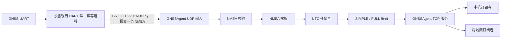

# GNSSAgent UDP 架构需求说明与系统设计

> **状态：已被取代。** 本文内容已重组并合入 [`GNSSAgent-Requirements.md`](./GNSSAgent-Requirements.md)；自 2026-08-24 起不再作为独立需求基线。

- 文档版本：1.0
- 对外状态协议版本：1
- UDP 输入协议版本：1
- 日期：2026-08-03
- 状态：待评审
- UDP 输入协议：[`GNSSAgent-UDP-NMEA-Protocol-v1.md`](../../protocol/GNSSAgent-UDP-NMEA-Protocol-v1.md)
- 对外状态协议：[`GNSSAgent-Binary-Protocol-v1.md`](../../protocol/GNSSAgent-Binary-Protocol-v1.md)

## 1. 背景

每种目标设备已经存在一个唯一读写 GNSS UART 的进程。例如，MMR200 中该进程为 `copy_RadioApp`。`GNSSAgent` 不改变现有串口所有权，不打开、不读取、不写入 GNSS UART。

现有 GNSS UART 进程每收到一条完整 NMEA，就通过本机 UDP 原样发送给 `GNSSAgent`。`GNSSAgent` 负责 NMEA 校验、解析、按 UTC 秒聚合，并通过现有 TCP 二进制协议向本机或局域网订阅者发布 SIMPLE 或 FULL 状态。

## 2. 建设目标

1. `GNSSAgent` 随设备启动运行，只从本机 UDP 获取原始 NMEA。
2. 保持每台设备现有 GNSS UART 唯一读写者不变。
3. 支持 GPS、北斗、GPS+北斗及现有解析器支持的其他 NMEA talker。
4. 将同一 GNSS UTC 秒内的数据聚合为最多一条状态消息。
5. 同时提供 SIMPLE 和 FULL 两种固定布局状态，由订阅者选择。
6. 保持现有 NMEA 解析、聚合、字段语义和 TCP 订阅行为不变。
7. 一套 Go 源码面向 CCU、HF、MultibandRadio、MultibandHandheld 构建对应可执行程序。

## 3. 范围

### 3.1 本期包含

- 本机 UDP NMEA 接收。
- UDP 数据报格式、长度和来源校验。
- NMEA 校验和校验及字段解析。
- RMC、GGA、GLL、GSA、GSV、GST、ZDA 数据聚合。
- GPS、北斗、GLONASS、Galileo 可见卫星数量统计。
- 使用中卫星平均 C/N0 计算。
- TCP SIMPLE/FULL 订阅和状态发布。
- 二进制协议流式解帧和错误重同步。
- 目标设备交叉编译和 SysV 服务运行方式。

### 3.2 本期不包含

- GNSS UART 打开、配置、读取、写入、独占或重连。
- `$RESET`、`$CFGSYS`、`$CFGSAVE` 等 GNSS 模块命令。
- GNSS 开关、模式切换、GPIO 或天线控制。
- `GNSS_SWITCH_REQ`、`GNSS_SWITCH_ACK` 或其他控制消息。
- UDP 应用层包头、版本字段、序号、时间戳、长度字段、ACK、重传或心跳。
- 单颗卫星编号、方位角、仰角和 C/N0 对外上报。
- Protobuf、JSON 或文本状态协议。
- TLS、鉴权、访问令牌和本机进程身份认证。
- GNSS 1PPS 接入或修改本机系统时间。
- `device_id`、`antenna_id`、`antenna_status`。
- 推导后的 `horizontal_accuracy`、`vertical_accuracy`。
- 独立 RESET 消息和 `GNSSAgent-CCU-Audio` 构建产物。

## 4. 系统边界与职责



### 4.1 GNSS UART 唯一读写进程职责

- 保持当前设备上的 GNSS UART 唯一读写权。
- 继续负责设备已有的串口配置、重连、模块命令、GPIO 和模式切换。
- 从串口取得完整 NMEA 后，按 UDP 输入协议原样发送。
- 使用同一个 UDP socket，按串口接收顺序发送。
- 完整语句形成后立即调用 UDP 发送，不得定时批量发送或等待后续语句。
- UDP 发送失败不得阻塞串口读取或影响原有业务；继续发送后续 NMEA。
- 不等待 `GNSSAgent` ACK，不因 `GNSSAgent` 启停而复位或重新配置 GNSS 模块。

### 4.2 `GNSSAgent` 职责

- 监听本机 UDP，接收原始 NMEA。
- 不探测设备串口，不持有任何 GNSS UART 文件描述符。
- 对实际收到的 NMEA 进行校验和解析，不把设备保存的 UI 模式当作解析依据。
- 维护每秒聚合状态并按订阅格式编码。
- 向本机及可信局域网订阅者发布 GNSS 状态。
- 没有收到正确 NMEA 时保持静默，不伪造无数据状态。

## 5. 运行环境与构建

### 5.1 实现语言

- 使用 Go。
- `go.mod` 语言基线为 Go 1.23，源码不得依赖 Go 1.24 及以上才提供的语言或标准库能力。
- `CGO_ENABLED=0`，生成无 CGO 依赖的单文件可执行程序。
- 构建参数包含 `-trimpath` 和链接参数 `-s -w`。

### 5.2 构建矩阵

| 产物 | Go 工具链 | GOOS | GOARCH | 补充参数 |
|---|---:|---|---|---|
| `GNSSAgent-CCU` | 1.25.5 | linux | amd64 | 无 |
| `GNSSAgent-HF` | 1.23.12 | linux | arm | `GOARM=7` |
| `GNSSAgent-MultibandRadio` | 1.25.5 | linux | arm64 | `GOARM64=v8.0` |
| `GNSSAgent-MultibandHandheld` | 1.25.5 | linux | arm | `GOARM=7` |

目标类型通过链接参数写入构建信息。所有目标使用相同 UDP 和 TCP 默认值，不配置串口路径或波特率。

### 5.3 运行参数

| 参数 | 默认值 | 说明 |
|---|---:|---|
| UDP NMEA listen | `127.0.0.1:29501` | 只接收本机 NMEA 数据报 |
| TCP status listen | `0.0.0.0:29501` | SIMPLE/FULL 订阅服务 |
| max connections | `5` | TCP 总连接数，包含尚未订阅连接 |
| max remote connections | `4` | 非环回 TCP 连接上限，保留一个本机订阅名额 |

UDP 和 TCP 属于不同传输协议，可以同时使用端口号 `29501`。监听地址、端口和连接上限允许通过命令行覆盖。UDP 监听地址不得配置为非环回地址。

## 6. UDP NMEA 输入

### 6.1 传输格式

- 使用 IPv4 UDP。
- 默认目标为 `127.0.0.1:29501/UDP`。
- 一个 UDP 数据报只包含一条完整 NMEA。
- UDP 载荷就是原始 NMEA，不增加应用层包头或长度字段。
- NMEA 以 `$` 开始，`*HH` 后可无换行符，也可使用 LF 或 CRLF。
- 单个数据报最大 1024 字节，包含可选换行符。
- 不允许把一条 NMEA 拆成多个数据报。
- 不允许在一个数据报中放入多条 NMEA。
- 不允许在末尾添加 NUL 字节。

UDP socket 接收接口返回本次数据报的载荷长度，该长度就是 NMEA 长度。`GNSSAgent` 不解析任何自定义长度字段。

本 UDP v1 没有线内版本字段。端口 `29501/UDP` 固定表示“一个数据报一条原始 NMEA”。未来若增加时间戳、序号或其他应用层包头，必须使用新的 UDP 端口，不能在 `29501/UDP` 上混用新旧格式。

### 6.2 接收规则

- TCP 服务与 UDP 输入管理器独立启动。UDP 绑定失败时 TCP 服务继续运行，UDP 输入管理器按 1、2、4、8、16、30 秒退避重试，后续重试间隔保持 30 秒；日志必须限频。绑定成功后重置退避状态。
- UDP socket 发生不可恢复的读取错误时，关闭该 socket、丢弃未完成周期并按同一退避序列重新绑定。
- 只接收环回接口数据，发送端源端口不作固定要求。
- UDP socket 必须请求设置 `SO_RCVBUF=256 KiB`，随后读取并记录内核实际生效值。受 `rmem_max` 限制未达到请求值时记录告警但继续运行。
- Linux 目标必须启用 `SO_RXQ_OVFL`，从接收辅助数据累计本 socket 自创建以来的内核丢包增量。目标内核不支持时，使用当前 socket 在 `/proc/net/udp` 中的 `drops` 列作为回退；两种方式都不可用时必须明确记录“UDP 内核丢包不可观测”。
- 每个数据报独立校验；非法数据报不与前后数据报拼接。
- 必须识别并丢弃超过 1024 字节或被接收缓冲区截断的数据报。
- 空数据报、非 `$` 开头、包含多条 NMEA 或带多余尾部数据的报文直接丢弃。
- 数据报丢失不重传；后续数据继续处理。
- 数据报按 UDP socket 交付顺序处理，不提供应用层乱序恢复。
- UDP 收包不得被 TCP 客户端发送阻塞。

### 6.3 启停语义

- `GNSSAgent` 和 UART 唯一读写进程没有握手或连接状态。
- UART 进程先启动时，`GNSSAgent` 绑定 UDP 前的数据报允许丢失。
- `GNSSAgent` 重启后从下一条收到的 NMEA 继续工作，不要求发送端重启或补发。
- UART 进程停止或 GNSS 关闭后，`GNSSAgent` 不发布无数据状态。
- UDP 恢复后，不继承停止前未完成周期或旧字段。

### 6.4 `recv_time`

`recv_time` 是本周期第一条校验正确的 NMEA 数据报被 `GNSSAgent` 从 UDP socket 读取时的本机 Unix 毫秒时间。

它不表示 UART 进程从串口收到该语句的时间，也不补偿 UART 进程内部处理和 UDP 发送延迟。它不是服务运行时长，也不是 GNSS 时间。

定义 UART 转发延迟：

```text
forward_delay = GNSSAgent 的 recvfrom/recvmsg 返回时间 - UART 进程形成完整 NMEA 的时间
```

当前不为 `forward_delay` 规定未经实测的固定上界。每种目标设备必须在实机验收中记录其 p50、p95、p99 和最大值。本机消费者使用 `recv_time` 授时时，最终误差包含该转发延迟；精度要求严于实测最大转发延迟的业务不得仅依赖本文的授时补偿公式。

## 7. NMEA 校验与解析

### 7.1 校验规则

- 只处理包含 `*HH` 且 XOR 校验和正确的语句。
- 校验范围为 `$` 与 `*` 之间的字节，不包含二者。
- 校验失败、字段格式错误或非有限浮点数只影响当前语句，不停止服务。
- 支持 talker：`GP`、`BD`/`GB`、`GN`、`GL`、`GA`。
- 其他标准语句和厂商私有语句在 v1 中忽略。

### 7.2 支持的语句

| 语句 | 用途 |
|---|---|
| RMC | UTC 日期与时间、定位有效性、位置、地速、地面航向 |
| GGA | 定位质量、位置、海拔、椭球高、使用卫星数、GGA HDOP、差分龄期 |
| GLL | UTC 时分秒、定位有效性、位置、模式 |
| GSA | 2D/3D 状态、使用卫星编号、PDOP/HDOP/VDOP |
| GSV | 各星座可见卫星数及卫星 C/N0 |
| GST | 伪距 RMS 与位置误差椭圆七个原始统计字段 |
| ZDA | UTC 日期与时间 |

GST 字段作为跨设备协议能力保留。当前 MultibandRadio 不输出 GST，因此 FULL 有效位 22–28 预期为 0；GST 使用构造输入完成单元测试。当前目标不输出 GL/GA 时，GLONASS/Galileo 计数位 12、13 同样保持为 0。

## 8. 每秒聚合

1. RMC、GGA、GLL、GST、ZDA 自带 UTC 时分秒，使用 UTC 整秒作为周期键。
2. GSA、GSV 没有完整 UTC 时间，按到达顺序附着到当前周期。
3. 新 UTC 秒到达时完成并发布前一周期。
4. 下一秒语句未到时，当前周期在首句到达 1.5 秒后完成。
5. 同一个 UTC 秒最多发布一条状态消息。
6. 同一周期的多条 GSA 合并使用卫星集合，不得由后一条覆盖前一条。
7. GSV 收齐一个星座声明的全部分包后，才认定计数及相关 C/N0 有效。
8. `GPGSV,1,1,00` 表示完整周期中可见卫星数有效且为 0。
9. 每个周期重新建立字段和值的有效位，不从上一周期继承。
10. 没有校验正确的 NMEA 时，不创建周期、不发送状态、不发送应用心跳。
11. NMEA 正常到达但导航解无效时仍发布状态，并将 `valid` 置为 0。
12. UDP 输入中断或服务重启时丢弃未完成周期。

## 9. GNSS 数据模型

### 9.1 有效性总则

- FULL 和 SIMPLE 各自拥有独立的 `field_validity_mask`。
- 位为 1 表示来源字段存在、格式正确且数值可表示；位为 0 表示不可用。
- 无效字段的载荷字节统一编码为 0，消费者不得通过数值是否为 0 判断有效性。
- `0` 可能是合法值，例如差分龄期、卫星数量、速度或 `valid=0`。
- `valid` 表示导航解是否可用，与字段是否成功解析是两个概念。
- 时间字段有效性不依赖位置解是否有效。
- 不得发送 NaN 或 Infinity。

### 9.2 FULL 状态字段

FULL 载荷固定为 124 字节：

| 位 | 字段 | 类型 | 数据来源 | 含义 |
|---:|---|---|---|---|
| 0 | `utc_time` | uint64 | RMC | GNSS UTC Unix 毫秒 |
| 1 | `recv_time` | uint64 | UDP 接收 | 周期首条正确 NMEA 的 UDP 接收时间 |
| 2 | `latitude` | float64 | GGA 优先、RMC 次之、GLL 备用 | 纬度，度 |
| 3 | `longitude` | float64 | GGA 优先、RMC 次之、GLL 备用 | 经度，度 |
| 4 | `altitude_msl` | float64 | GGA | 平均海平面海拔，米 |
| 5 | `altitude_ellipsoid` | float64 | GGA | 椭球高，米 |
| 6 | `valid` | uint8 | RMC、GGA、GLL | 导航解是否有效，0/1 |
| 7 | `fix_dimension` | uint8 | GSA | 1=无定位，2=2D，3=3D |
| 8 | `solution_type` | uint8 | GGA | GGA quality 原值 |
| 9 | `used_satellites` | uint8 | GGA 优先、GSA 备用 | 参与定位卫星总数 |
| 10 | `gps_satellites` | uint8 | 完整 GPS GSV | 可见 GPS 卫星数 |
| 11 | `beidou_satellites` | uint8 | 完整北斗 GSV | 可见北斗卫星数 |
| 12 | `glonass_satellites` | uint8 | 完整 GLONASS GSV | 可见 GLONASS 卫星数 |
| 13 | `galileo_satellites` | uint8 | 完整 Galileo GSV | 可见 Galileo 卫星数 |
| 14 | `gga_hdop` | float32 | GGA | GGA HDOP |
| 15 | `gsa_pdop` | float32 | GSA | GSA PDOP |
| 16 | `gsa_hdop` | float32 | GSA | GSA HDOP |
| 17 | `gsa_vdop` | float32 | GSA | GSA VDOP |
| 18 | `differential_age` | float32 | GGA | 差分修正龄期，秒 |
| 19 | `avg_used_cn0` | float32 | GSA+完整 GSV | 使用中卫星平均 C/N0，dB-Hz |
| 20 | `ground_speed_mps` | float32 | RMC | 地速，米/秒 |
| 21 | `course_over_ground_deg` | float32 | RMC | 地面航向，度 |
| 22 | `gst_pseudorange_rms` | float32 | GST | 伪距残差 RMS，米 |
| 23 | `gst_semi_major_error` | float32 | GST | 误差椭圆半长轴 1σ，米 |
| 24 | `gst_semi_minor_error` | float32 | GST | 误差椭圆半短轴 1σ，米 |
| 25 | `gst_orientation_deg` | float32 | GST | 误差椭圆方向，度 |
| 26 | `gst_latitude_error` | float32 | GST | 纬度方向 1σ 误差，米 |
| 27 | `gst_longitude_error` | float32 | GST | 经度方向 1σ 误差，米 |
| 28 | `gst_altitude_error` | float32 | GST | 高度方向 1σ 误差，米 |

精确偏移、编码和枚举值按对外状态协议执行。

### 9.3 `valid` 计算

- RMC 和 GLL 通过状态字段报告有效或无效，GGA 通过 quality 是否为 0 报告有效或无效。
- RMC、GGA、GLL 同时存在时，任意一个明确无效，则 `valid=0`。
- 只存在其中一种时采用该语句结论；存在多种且均明确有效时 `valid=1`。
- 三者都没有明确结论时，`valid` 有效位清 0，值编码为 0。
- 消费者使用位置时必须同时检查经纬度有效位、`valid` 有效位和 `valid==1`。

### 9.4 卫星统计

- 卫星身份严格按以下优先级确定：① GSA System ID；② 能指明星座的 talker（`GP`、`BD`/`GB`、`GL`、`GA`）；③ 本周期完整 GSV 中仅有一个星座包含该原始 PRN 的唯一匹配；④ 经当前目标实机确认的 PRN 区间映射。没有实机证据时不得写死厂商相关 PRN 区间，也不得按多条 GSA 的出现顺序绑定星座。
- 当前 MultibandRadio 的 `GNGSA` 没有 System ID，首次实现不得假定其中 PRN 的星座。完整 GSV 中同一原始 PRN 同时出现在多个星座时仍为歧义。
- `used_satellites` 优先使用 GGA 数量。GGA 缺失时：已确定星座的卫星按“星座 + PRN”去重；对未确定星座的 GN GSA，先收集所有非空原始 PRN。若每个原始 PRN 只出现一次且不与已确定身份集合中的原始 PRN 重号，则每个槽计为一颗；若某个未确定 PRN 在多条 GSA 中重复，或与已确定集合中的原始 PRN 相同，且不能通过唯一 GSV 匹配消除歧义，则 `used_satellites` 整体无效，不能猜测它是一颗还是多颗卫星。
- GGA 与 GSA 数量冲突时使用 GGA，并记录限频告警。
- 四个星座计数字段表示可见卫星，不表示参与定位卫星。
- 只有 talker 或卫星编号能明确归属星座时才计数；无法明确归属时对应有效位不置 1。
- `avg_used_cn0` 只统计 GSA 标记为参与定位、身份可唯一关联，并且在本周期完整 GSV 中找到有效 C/N0 的卫星。歧义 PRN 不参与平均；没有唯一匹配项或 GSV 不完整时该字段无效。
- 声明 0 颗卫星且分包完整的 GSV 周期，其星座计数字段有效且值为 0；这不能与 GSV 缺失或缺包混淆。

### 9.5 DOP

`gga_hdop` 与 `gsa_hdop` 是两个独立字段，不能互相回填。DOP 的有效性规则如下：

- GGA quality 为 0 时，`gga_hdop` 无效，即使字段文本存在且可解析。
- GSA fix type 为 1 时，该条 GSA 的 PDOP/HDOP/VDOP 无效。
- 当前接收机使用 `127.000` 表示无定位 DOP；任一 DOP 等于 127.000 时，该条 GSA 的三项 DOP 整组无效，GGA 的 127.000 HDOP 也无效。
- 一个周期只有一组完整有效 GSA DOP 时，直接采用该组。
- 一个周期存在多组完整有效 GSA DOP 时，比较值必须直接从 NMEA 十进制字段文本生成，转换过程不得经过 binary32/binary64：按 `.` 拆分整数和小数部分；小数不足 3 位右补 0；超过 3 位时查看第 4 位，第 4 位为 5–9 则把前三位小数表示的整数加 1，并正确处理向整数部分的进位；第 5 位及以后不再影响 half-up 结果。最终得到 `dop_milli = integer_part × 1000 + rounded_fraction_milli`。三项 `dop_milli` 的组间差值都不超过 10（即 0.010，包含边界）时视为一致，并上报本周期第一组有效 GSA DOP 的原始解析值；任一项差值大于 10 时，三项 GSA DOP 全部无效并记录限频告警。不得取最后一条、最小值或平均值。
- 多条 GSA 的 `fix_dimension` 取所有可解析 fix type 的最大值；没有可解析值时该字段无效。
- 本周期没有有效 GSA DOP 时，`gsa_pdop`、`gsa_hdop`、`gsa_vdop` 均无效，但不影响有效的 `gga_hdop`。

### 9.6 高度和时间

- `altitude_msl` 来源于有限的 GGA 高度字段。
- `altitude_ellipsoid = altitude_msl + geoid_separation`，仅在 GGA quality 大于 0 且两个来源值都有效时置为有效。
- 无定位时的 `geoid_separation=0` 不得生成有效椭球高；有效定位时 0 可以是合法值。
- `utc_time` 由 RMC 日期和时间组合为 Unix 毫秒。
- RMC 日期或时间缺失、格式错误时，`utc_time` 无效并编码为 0。
- GGA/GST 时间只用于周期关联，不能单独构造 Unix 时间。
- RMC 导航无效不必然使 UTC 时间无效。
- 服务只上报时间，绝不调用系统校时接口。

本机消费者授时时，应在收到完整状态帧时立即记录 `client_recv_time`：

```text
target_at_client_receive = utc_time + (client_recv_time - recv_time)
```

该公式只补偿从 `GNSSAgent` UDP 收包到本机消费者收包之间的聚合和传输延迟，不补偿 UART 进程在 UDP 发送前的延迟，也不适用于远程消费者。

### 9.7 SIMPLE 状态字段

SIMPLE 载荷固定为 58 字节，拥有独立的 0–8 位有效掩码：

| 位 | 字段 | 类型 | 含义 |
|---:|---|---|---|
| 0 | `utc_time` | uint64 | GNSS UTC Unix 毫秒 |
| 1 | `recv_time` | uint64 | 周期首条正确 NMEA 的 UDP 接收时间 |
| 2 | `latitude` | float64 | 纬度，度 |
| 3 | `longitude` | float64 | 经度，度 |
| 4 | `altitude_msl` | float64 | 海拔，米 |
| 5 | `ground_speed_mps` | float32 | 地速，米/秒 |
| 6 | `course_over_ground_deg` | float32 | 地面航向，度 |
| 7 | `valid` | uint8 | 导航解是否有效，0/1 |
| 8 | `used_satellites` | uint8 | 参与定位卫星总数 |

字段含义和来源规则与 FULL 一致，但 SIMPLE 掩码位号不得按 FULL 位号解释。

## 10. TCP 订阅与发布

- 默认监听 `0.0.0.0:29501/TCP`。
- 最多保留 5 条 TCP 连接；其中非环回连接最多 4 条，为本机订阅者保留一个名额。
- 客户端连接后第一个有效应用消息必须是 `SUBSCRIBE_REQUEST`，选择 SIMPLE 或 FULL。
- 新连接必须在 5 秒内完成有效订阅，否则关闭连接。
- 订阅成功后只发送该连接选择的状态类型。
- 同一连接重复订阅返回 `ALREADY_SUBSCRIBED`；v1 不支持连接内切换格式。
- 超过总连接或远程连接上限时，不等待请求；若完整订阅请求已在接收缓冲区，可非阻塞返回 `SERVER_FULL`，否则立即关闭。
- TCP 断开不影响 UDP 接收、解析或聚合；重连后只重新订阅。
- TCP 按帧头长度进行流式解析，必须处理拆包和粘包。
- 状态频率最高约 1 Hz；无正确 NMEA 时没有状态帧或应用心跳。
- `GNSSAgent` 收到 `GNSS_SWITCH_REQ`（消息类型 `0x10`）时，将其作为本架构不支持的消息类型静默跳过整帧，不发送 `GNSS_SWITCH_ACK`、通用错误或其他响应。客户端不得发送 `0x10`，也不得等待 `0x11`。

### 10.1 慢客户端

每个订阅者只保留一个尚未发送的最新状态。新状态可以替换队列中尚未写出的旧状态。单次写入超过 3 秒仍未完成时关闭该 TCP 连接，不影响其他客户端或 UDP 输入。

## 11. 对外二进制协议约束

- SUBSCRIBE、SIMPLE 和 FULL 的消息类型、帧头、固定长度、字段偏移、字节序及 golden bytes 保持 v1 不变。
- 公共帧头为 4 字节 magic `GNSS`、1 字节版本、1 字节消息类型和 2 字节载荷长度。
- 所有多字节整数和浮点位模式使用大端序。
- 浮点使用 IEEE-754 binary32/binary64。
- 载荷逐字段编码，不使用编译器结构体布局。
- 单帧载荷上限 1024 字节。
- 协议格式错误不主动关闭连接；接收方扫描下一个 `GNSS` magic 重新同步。
- 未知消息类型在长度合理时跳过整帧。
- `GNSS_SWITCH_REQ`（`0x10`）按不支持的消息类型处理：长度不超过 1024 时静默跳过整帧，不发送任何响应，连接保持可用。
- 不提供通用 `ERROR` 帧。

独立二进制协议文档中的 `GNSS_SWITCH_REQ` 和 `GNSS_SWITCH_ACK` 不属于本文定义的 `GNSSAgent` 能力；实现和验收只使用 SUBSCRIBE、SIMPLE、FULL 相关章节。

## 12. 异常处理与恢复

| 场景 | 行为 |
|---|---|
| UDP 绑定失败 | TCP 服务继续；UDP 输入管理器按 1、2、4、8、16、30 秒退避重试，之后每 30 秒重试 |
| UDP socket 读取失败 | 关闭当前 socket、丢弃未完成周期并退避重绑 |
| UDP 接收队列丢包 | 累计内核 drops 增量并立即记录限频告警；后续数据继续处理 |
| UDP 暂时无数据 | TCP 服务继续；不发布状态 |
| UDP 空报文、超长、截断或格式非法 | 丢弃当前数据报并限频计数 |
| NMEA 校验错误 | 丢弃当前语句并限频计数 |
| NMEA 字段错误 | 只清对应字段有效位 |
| 某类语句缺失 | 相关字段无效，其他字段照常发布 |
| 完整周期没有正确 NMEA | 不发送通知 |
| 有 NMEA 但无定位 | 发布状态，`valid=0` |
| TCP 协议错误 | 不断开；扫描下一个 magic |
| 未知 TCP 消息类型 | 长度合理时跳过整帧 |
| 收到 `GNSS_SWITCH_REQ` (`0x10`) | 静默跳过整帧；不发送 `0x11` 或其他响应；连接保持可用 |
| TCP 总连接数达到 5 | 非阻塞返回 `SERVER_FULL` 或立即关闭 |
| 非环回连接数达到 4 | 拒绝新的非环回连接，保留本机名额 |
| 新连接 5 秒未订阅 | 关闭连接 |
| 客户端断开或写超时 | 回收该会话，不影响其他客户端和 UDP 输入 |

重复错误日志必须限频，避免异常数据写满设备存储。

## 13. 日志与可观测性

服务输出结构清晰的文本日志到 stdout/stderr，至少记录：

- 版本、构建目标和非敏感启动参数。
- 启动时系统 Unix 时间及格式化 UTC 时间。
- UDP 监听启动、关闭、绑定失败、重试和恢复。
- UDP `SO_RCVBUF` 请求值和内核实际生效值。
- UDP 每秒实收数据报数、字节数，以及按 talker/语句类型统计的正确 NMEA 数量；不使用固定“期望句数”判定丢包。
- 通过 `SO_RXQ_OVFL` 获得的 socket 接收队列累计丢包增量；不支持时记录 `/proc/net/udp` 的 `drops` 回退值和回退状态。
- UDP 空报文、超长或截断报文、格式错误数量，以及 GSV 完整/不完整周期数量。
- NMEA 校验失败、字段解析失败、周期发布和 TCP 慢客户端替换数量。
- TCP 连接建立、断开、订阅格式和容量拒绝。
- 连续 5 秒未收到校验正确 NMEA 时记录一次输入中断，恢复时记录一次恢复。

原始 NMEA 默认不逐句打印；调试级日志可以采样打印。所有周期性和重复日志必须限频。

## 14. 服务部署

- 使用目标设备现有 SysV init 体系随设备启动和守护。
- 启动脚本不检查串口路径，不执行 GNSS 命令，不操作 GPIO。
- `GNSSAgent` 与 UART 唯一读写进程没有严格启动顺序依赖。
- 推荐先启动 `GNSSAgent`，减少设备启动阶段 UDP 数据丢失。
- 服务进程异常退出后由启动脚本重启；UDP 绑定或读取失败由进程内输入管理器恢复，不得通过进程退出触发重启。
- 停止时关闭 UDP、停止接收新 TCP 连接并关闭现有连接。
- 启停、升级或重启 `GNSSAgent` 不得改变 GNSS 电源、模式或 UART 状态。
- UART 进程必须在 `GNSSAgent` 不存在或重启时继续原有串口业务。

## 15. 测试要求

### 15.1 UDP 输入测试

- UDP 首次绑定及读取失败时按 1、2、4、8、16、30 秒退避重试，期间 TCP 订阅服务保持可用；绑定恢复后退避状态重置。
- socket 初始化时请求 `SO_RCVBUF=256 KiB` 并读取实际生效值；覆盖内核上限导致实际值小于请求值的告警路径。
- 解析 `SO_RXQ_OVFL` 辅助数据并正确累计 drops 增量；覆盖 `/proc/net/udp` 回退和两种方式都不可用的日志路径。
- 一个数据报一条 NMEA，覆盖无换行、LF 和 CRLF。
- 证明接收长度直接来自 UDP socket，不读取应用层长度字段。
- 空报文、非 `$` 开头、NUL 尾部、一包多句、超长和截断报文被丢弃。
- 一条 NMEA 被拆成两个数据报时，两包均不得被拼接解析。
- UDP 暂停、恢复和 `GNSSAgent` 重启后能够从新数据继续工作。
- UDP 发送端不存在时 TCP 订阅服务仍可运行且保持静默。
- UDP 接收和聚合不被慢 TCP 客户端阻塞。

### 15.2 NMEA 与聚合单元测试

- GP、BD/GB、GN、GL、GA talker 的 RMC/GGA/GLL/GSA/GSV/GST/ZDA 解析。
- 空字段、非法数值、NaN/Inf、错误校验和和超长语句。
- RMC/GGA/GLL 有效性组合真值表。
- GGA HDOP 与 GSA 三项 DOP 独立。
- `127.000` DOP 哨兵清除对应有效位。
- GGA/GSA used satellites 优先和歧义回退规则。
- 多条 GSA 覆盖 System ID、星座 talker、GSV 唯一匹配、GN 无 System ID 且 PRN 唯一，以及 GN 无 System ID 且 PRN 重号歧义。
- GGA 缺失时，未确定星座的原始 PRN 均只出现一次且不与已确定身份集合重号，每个槽计为一颗。
- GGA 缺失时，未确定 PRN 在多条 GSA 中重复，或与已确定身份集合中的原始 PRN 重号，且不能通过唯一 GSV 匹配消除歧义，`used_satellites` 整体无效。
- 多组 GSA DOP 千分位差值 0、10、11；包含 `0.4895 → 490`、`0.5005 → 501` 和 `0.9995 → 1000` 回归用例，证明转换未经过二进制浮点且能正确向整数部分进位。
- GSV 完整、缺包、乱序和四星座计数。
- `GPGSV,1,1,00` 的有效 0 颗卫星语义。
- `avg_used_cn0` 关联、去重和无匹配失效。
- GST 七项构造输入。
- RMC 日期时间、小数秒、跨午夜周期。
- MSL 高度与椭球高，包括无定位 `geoid_separation=0`。
- 每周期重建掩码，不携带旧字段。

### 15.3 TCP 协议测试

- SUBSCRIBE、SIMPLE、FULL 固定长度、偏移、大端序和 golden bytes。
- 无效字段编码为 0，SIMPLE/FULL 掩码独立。
- TCP 半帧、粘包、magic 跨读取边界、垃圾前缀、超大长度和未知类型。
- 格式错误后恢复解析下一正确帧，连接不因格式错误关闭。
- SIMPLE/FULL 订阅隔离、重复订阅、非法格式和 5 秒未订阅超时。
- 5 条总连接上限、4 条非环回上限和本机保留名额。
- `GNSS_SWITCH_REQ` 作为不支持的客户端消息被静默跳过，不产生 ACK、错误响应、UART、GPIO 或控制行为；随后发送的合法帧仍可正常处理。

### 15.4 集成测试

- 使用 UDP 发送录制的 GPS、北斗和组合模式 NMEA，检查 1 Hz 聚合结果。
- 无 UDP NMEA 时订阅保持连接但无状态帧。
- 无定位 NMEA 到达时收到 `valid=0` 状态。
- UDP 发送端和 `GNSSAgent` 以任意顺序启动，恢复后正常发布。
- `GNSSAgent` 重启只造成短暂数据中断，不影响 UART 进程。
- 四个持续 LAN 订阅者不能阻止本机第 5 个订阅者连接。
- 慢客户端不阻塞其他客户端和 UDP 接收。
- 四个目标产物完成交叉编译和对应架构启动检查。

### 15.5 实机验收

每种目标设备至少完成：

1. GNSS UART 只由设备现有唯一读写进程持有，`GNSSAgent` 不打开任何 GNSS UART。
2. 同时使用 `strace` 或等价旁路方式采集 UART 唯一读写进程的 `read()` 返回字节，并使用 `tcpdump -i lo -s 0` 采集 `udp port 29501`。从 UART 字节流重建完整 NMEA，与同一有效采集窗口内的 UDP 载荷按内容和顺序逐句比较；排除窗口起止处的半句后，必须满足每条 UART NMEA 恰好对应一个 UDP 数据报，丢失、重复和乱序均为 0。验收工具应直接输出 UART 完整句数、UDP 数据报数及首个不一致位置。旁路 UART 采集必须通过 UART 内核 RX 字节增量或等价依据证明自身完整；若 `strace` 重建流缺字节，本轮结果标记为“采集无效”，不得把差异归因于 UDP。
3. GPS、北斗、组合模式的 talker 和状态字段符合预期。
4. GNSS 关闭后不发布状态，重新开启并收到 UDP NMEA 后恢复发布。
5. `GNSSAgent` 不发送 GNSS 控制命令、不操作 GPIO、不修改系统时间。
6. `GNSSAgent` 在 UART 进程之前或之后启动都能恢复工作。
7. `GNSSAgent` 重启不造成 GNSS 复位、模式变化或 UART 进程异常。
8. TCP 总连接数不超过 5，非环回连接不超过 4，SIMPLE/FULL 数据不串格式。
9. 当前目标不输出 GST/GL/GA 时，相应 FULL 有效位保持为 0。
10. 无定位且 RMC 日期为空时 `utc_time` 无效；得到带日期 RMC 后正常上报。
11. 在同一轮采集中，通过 `strace -f -ttt` 或等价单调时钟诊断同时取得 UART 完整 NMEA 形成时间和 `GNSSAgent` 的 `recvfrom`/`recvmsg` 返回时间，按匹配语句计算 `forward_delay` 的 p50、p95、p99 和最大值并归档；本版本不预设未经实测的 10 ms 上界。
12. 连续运行 24 小时，无异常退出、持续内存增长、旧字段跨周期残留或 UDP socket 接收队列丢包；归档 `SO_RCVBUF` 实际值和 `SO_RXQ_OVFL`/`/proc/net/udp` drops 结果。
13. C++11 用户侧按状态协议文档完成订阅、解码和有效性判断。

UART 波特率、链路占用率、overrun/frame/parity、串口断开和模块命令验收属于各设备 UART 唯一读写进程的职责，不属于 `GNSSAgent` 验收范围。

## 16. 已确认事实与信任假设

- 每种目标设备当前都有唯一的 GNSS UART 读写进程。
- MMR200 的 GNSS UART 唯一读写进程为 `copy_RadioApp`。
- `GNSSAgent` 不读写任何 GNSS UART，只通过本机 UDP 接收 NMEA。
- UDP 输入为一个数据报一条原始 NMEA，不使用应用层包头或长度字段。
- UDP 和 TCP 默认同时使用端口号 29501，传输协议不同，不冲突。
- 当前目标按可信本机进程环境部署，恶意本机进程不在威胁模型内。绑定 `127.0.0.1` 只限制远程输入，不认证发送进程；任何能向 `127.0.0.1:29501/UDP` 发包的本机进程都能注入可通过校验的 NMEA，并被发布给订阅者。若未来存在不可信本机进程，必须改用带发送者身份校验的 IPC 或增加认证，不能继续依赖本协议的环回地址约束。
- UDP v1 没有线内版本字段；未来增加时间戳、序号或包头时必须更换 UDP 端口，`29501/UDP` 继续保留为原始 NMEA 格式。
- MultibandRadio 当前组合模式每周期可能输出多条 `GNGSA`。
- 当前 MultibandRadio 不输出 GST、ZDA、GL/GA；相应字段保持协议能力但预期无效。
- 当前模块无定位时可能输出 `127.000` DOP、空 RMC 日期和不可信的 `geoid_separation=0`。
- `GNSSAgent` 不提供 GNSS 开关、模式切换或串口命令能力。

## 17. 完成定义

以下条件全部满足才视为完成：

- 本文所有本期范围均实现并通过对应测试。
- 现有需求文档未被修改，本文件作为 UDP 架构的独立需求基线。
- UDP 实现与独立 UDP 输入协议逐条一致。
- SUBSCRIBE、SIMPLE、FULL 线格式与现有二进制协议 v1 逐字节一致。
- 所有目标上均证明 `GNSSAgent` 不访问 GNSS UART、不执行控制命令。
- 无数据静默、有数据无定位仍发布的行为通过实机验证。
- UART 进程或 `GNSSAgent` 任一方重启后可以自然恢复，不产生 GNSS 设备副作用。
- 所有目标产物可重复构建并通过 24 小时运行验收。
- 用户侧 C++11 消费者能仅依据状态协议完成 SIMPLE/FULL 订阅、解码和有效性判断。
