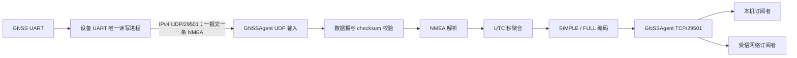

# GNSSAgent 需求规格

- 文档标识：`GNSS-REQ`
- 文档版本：1.1
- 修订日期：2026-08-24
- 状态：现行需求基线
- UDP 输入协议：[`GNSSAgent-UDP-NMEA-Protocol-v1.md`](../../protocol/GNSSAgent-UDP-NMEA-Protocol-v1.md)
- TCP 状态协议：[`GNSSAgent-Binary-Protocol-v1.md`](../../protocol/GNSSAgent-Binary-Protocol-v1.md)
- 设备验收方案：[`GNSSAgent-Device-GNSS-UDP-Test-Plan.md`](../../testing/GNSSAgent-Device-GNSS-UDP-Test-Plan.md)

## 1. 文档控制

### 1.1 基线与优先级

本文件是 `GNSSAgent` 唯一有效的产品需求基线。后续需求变更直接修改本文件，保持文件路径和既有需求编号稳定，并在修订记录中说明变化。

- 本文件定义产品范围、外部行为、字段语义和验收标准。
- UDP 输入协议定义 `29501/UDP` 的线格式。
- TCP 状态协议定义帧头、消息类型、字段偏移、字节序和 golden frames。
- 当范围或产品行为存在冲突时，以本文件为准；当线格式细节存在冲突时，以对应协议文档为准。发现冲突后必须在发布前同步修正文档，不能长期保留两种解释。
- 历史需求、设计和实施计划只用于追溯，不再作为验收依据。

### 1.2 规范用语

- “必须”“不得”表示强制要求。
- “应”表示推荐要求；偏离时必须给出可验证的理由。
- “可以”表示允许但不强制。
- 每条 `REQ-*` 编号用于测试、缺陷和评审追踪；修改要求时不得把原编号复用于无关含义。

### 1.3 修订记录

| 版本 | 日期 | 说明 |
|---|---|---|
| 1.1 | 2026-08-24 | 补充 SIMPLE/FULL 订阅请求、订阅 ACK、消息类型和完整状态字段布局。 |
| 1.0 | 2026-08-24 | 以 UDP 架构为基础，合并 2026-08-03 之后的运行、协议、构建、部署和验收变更，建立长期维护基线。 |

## 2. 背景、目标与范围

### 2.1 背景

每种目标设备已有一个负责 GNSS UART 的唯一读写进程。该进程从串口获得完整 NMEA 后，通过 IPv4 UDP 原样转发给 `GNSSAgent`。`GNSSAgent` 不改变串口所有权，只负责 UDP 接收、NMEA 校验与解析、UTC 秒聚合，以及通过 TCP 二进制协议发布 SIMPLE 或 FULL 状态。

### 2.2 建设目标

- `REQ-GOAL-001`：`GNSSAgent` 必须能够随设备启动并持续运行，不直接访问 GNSS UART。
- `REQ-GOAL-002`：系统必须保持每台设备现有 GNSS UART 唯一读写者不变。
- `REQ-GOAL-003`：系统必须支持 GPS、北斗以及组合星座场景，并保留 GLONASS、Galileo 的协议能力。
- `REQ-GOAL-004`：系统必须把同一 GNSS UTC 秒的数据聚合为最多一条状态消息。
- `REQ-GOAL-005`：系统必须同时提供由订阅者选择的 SIMPLE 和 FULL 固定布局状态。
- `REQ-GOAL-006`：UDP 输入、TCP 发布和单个客户端故障必须相互隔离，任一慢客户端不得阻塞 GNSS 输入。
- `REQ-GOAL-007`：同一套 Go 源码必须能够构建五种受维护的设备目标。

### 2.3 本期范围

- IPv4 UDP NMEA 接收、数据报边界校验、NMEA checksum 校验和字段解析。
- RMC、GGA、GLL、GSA、GSV、GST、ZDA 的 UTC 秒聚合。
- SIMPLE/FULL TCP 订阅、固定布局编码、流式解帧和错误重同步。
- GPS、北斗、GLONASS、Galileo 可见卫星统计及使用中卫星平均 C/N0。
- 连接限制、慢客户端隔离、日志、运行统计、输入中断检测和恢复。
- CCU、HF、MultibandRadio、MultibandHandheld、SmallRadio 的构建与启动验证。
- SysV init 部署、进程守护和设备侧验收。

### 2.4 非目标

- `REQ-SCOPE-001`：`GNSSAgent` 不得打开、配置、读取、写入、独占或重连 GNSS UART。
- `REQ-SCOPE-002`：`GNSSAgent` 不得发送 `$RESET`、`$CFGSYS`、`$CFGSAVE` 或其他 GNSS 模块命令。
- `REQ-SCOPE-003`：`GNSSAgent` 不提供 GNSS 开关、模式切换、GPIO、天线控制或系统校时能力。
- `REQ-SCOPE-004`：`GNSSAgent` 不实现 `GNSS_SWITCH_REQ`、`GNSS_SWITCH_ACK` 或其他控制响应。
- `REQ-SCOPE-005`：UDP v1 不增加应用层包头、版本字段、序号、时间戳、长度字段、ACK、重传或心跳。
- `REQ-SCOPE-006`：本版本不提供 TLS、应用层鉴权、访问令牌或发送进程身份认证。
- `REQ-SCOPE-007`：本版本不对外发布单颗卫星明细、1PPS、`device_id`、`antenna_id`、`antenna_status` 或推导后的水平/垂直精度。
- `REQ-SCOPE-008`：本版本不提供 JSON、Protobuf 或文本状态协议，也不生成 `GNSSAgent-CCU-Audio`。

## 3. 系统边界与职责



### 3.1 UART 唯一读写进程

- `REQ-ARCH-001`：该进程必须保持设备上的 GNSS UART 唯一读写权，并继续承担既有串口配置、重连、模块命令、GPIO 和模式切换职责。
- `REQ-ARCH-002`：每形成一条完整 NMEA，必须立即通过同一个 UDP socket 原样发送一个数据报，不得等待后续语句或定时批量发送。
- `REQ-ARCH-003`：发送顺序必须与 UART 完整语句顺序一致；不得修改、合并、拆分、重复或主动重排 NMEA。
- `REQ-ARCH-004`：UDP 发送失败不得阻塞串口读取或影响原有业务；发送端必须继续处理后续 NMEA。
- `REQ-ARCH-005`：发送端不得等待 `GNSSAgent` ACK，也不得因 `GNSSAgent` 启停而复位或重新配置 GNSS 模块。

### 3.2 GNSSAgent

- `REQ-ARCH-006`：`GNSSAgent` 必须只从配置的 IPv4 UDP socket 获取原始 NMEA，不得探测或持有 GNSS UART 文件描述符。
- `REQ-ARCH-007`：`GNSSAgent` 必须依据实际收到的 NMEA 判断字段和导航状态，不得用设备 UI 中保存的模式替代报文内容。
- `REQ-ARCH-008`：没有成功校验和解析的 NMEA 时，`GNSSAgent` 必须保持状态发布静默，不得伪造无数据状态或应用心跳。
- `REQ-ARCH-009`：有合法 NMEA 但导航解无效时，`GNSSAgent` 必须发布本周期状态，并明确编码 `valid=0`。

## 4. 设备目标与构建要求

### 4.1 构建矩阵

| 目标 | 输出文件 | GOOS/GOARCH | 补充参数 | 构建标识 |
|---|---|---|---|---|
| CCU | `GNSSAgent-CCU` | `linux/amd64` | — | `ccu` |
| HF | `GNSSAgent-HF` | `linux/arm` | `GOARM=7` | `hf` |
| MultibandRadio | `GNSSAgent-MultibandRadio` | `linux/arm64` | `GOARM64=v8.0` | `multiband-radio` |
| MultibandHandheld | `GNSSAgent-MultibandHandheld` | `linux/arm` | `GOARM=7` | `multiband-handheld` |
| SmallRadio | `GNSSAgent-SmallRadio` | `linux/mipsle` | `GOMIPS=hardfloat` | `small-radio` |

- `REQ-BUILD-001`：源码语言基线必须保持为 Go 1.23，不得无评审依赖 Go 1.24 及以上才提供的语言或标准库能力。
- `REQ-BUILD-002`：所有设备产物必须设置 `CGO_ENABLED=0`，使用 `-trimpath` 和 `-ldflags="-s -w"`，并把表中构建标识写入 `gnssagent/internal/buildinfo.Target`。
- `REQ-BUILD-003`：Linux Make 与 Windows PowerShell 必须产出相同名称和目标架构的设备文件，统一写入 `build/dist/bin/`。
- `REQ-BUILD-004`：普通目标优先使用可用的系统 Go；系统 Go 不存在时必须使用已校验的内置 Go 1.26.4。Linux 普通目标在系统 Go 命令失败后可以用内置 Go 重试一次；PowerShell 选定工具链后不得因构建失败切换工具链重试。
- `REQ-BUILD-005`：HF 只能使用精确的 Go 1.23.12 系统工具链或已校验的内置 Go 1.23.12；选定工具链后的实际构建只执行一次。
- `REQ-BUILD-006`：构建工具不得隐式下载 Go 工具链；内置归档缺失、哈希不符、解压失败或版本不符时必须失败关闭。
- `REQ-BUILD-007`：构建脚本必须恢复调用前的进程环境，不得把 `GOARCH`、`GOARM`、`GOARM64`、`GOMIPS`、`GOROOT` 或 `GOTOOLCHAIN` 泄漏给后续命令。
- `REQ-BUILD-008`：清理操作只删除明确命名的五个输出文件，不得递归删除工具链、缓存或目录。

## 5. 运行参数、部署与生命周期

### 5.1 运行参数

| 参数 | 程序默认值 | 要求 |
|---|---:|---|
| `--udp-listen` | `0.0.0.0:29501` | 非零 IPv4 地址和端口 |
| `--tcp-listen` | `0.0.0.0:29501` | TCP 状态订阅地址 |
| `--max-connections` | `5` | 大于 0 |
| `--max-remote-connections` | `4` | 大于等于 0 且小于总连接上限 |
| `--log-level` | `info` | `debug`、`info`、`warn`/`warning`、`error` |
| `--log-file` | 空 | 为空时写 stderr；部署配置可指定轮转文件 |
| `--log-max-bytes` | `8388608` | 大于 0 |

- `REQ-CONFIG-001`：UDP 和 TCP 可以同时使用端口 29501；两者传输协议不同，不构成端口冲突。
- `REQ-CONFIG-002`：五种构建目标必须使用相同的运行默认值，不得根据构建标识隐式改变网络、连接或日志配置。
- `REQ-CONFIG-003`：非法参数必须在启动网络服务前返回非零错误；不得静默回退到其他值。

### 5.2 部署与生命周期

- `REQ-DEPLOY-001`：生产设备必须通过现有 SysV init 体系启动和守护 `GNSSAgent`。
- `REQ-DEPLOY-002`：启动脚本不得检查串口路径、执行 GNSS 命令、操作 GPIO 或改变 UART 进程状态。
- `REQ-DEPLOY-003`：启动顺序不得构成硬依赖。推荐先启动 `GNSSAgent` 以减少早期 UDP 丢失，但任一方后启动都必须自然恢复。
- `REQ-DEPLOY-004`：UDP 绑定或读取故障由进程内输入管理器恢复，不得依赖结束整个进程来恢复 UDP。
- `REQ-DEPLOY-005`：服务进程意外退出后，守护脚本必须按 1、2、4、8、16、30 秒退避重启，后续保持 30 秒；单次运行达到 60 秒后，下一次退避从 1 秒重新开始。
- `REQ-DEPLOY-006`：停止服务时必须停止 UDP 接收、停止接受 TCP 连接、关闭现有会话并终止子进程；PID 文件不属于 `GNSSAgent` 监护进程时不得误杀该进程。
- `REQ-DEPLOY-007`：启停、升级或重启 `GNSSAgent` 不得改变 GNSS 电源、模式、UART 状态或 UART 唯一读写进程的原有业务。

## 6. UDP NMEA 输入要求

### 6.1 网络与数据报格式

- `REQ-UDP-001`：输入必须使用 IPv4 UDP，默认监听 `0.0.0.0:29501`，并允许本机或远端 IPv4 发送方；发送端源端口不作限制。
- `REQ-UDP-002`：一个数据报必须且只能包含一条完整原始 NMEA，不增加应用层包头或长度字段。
- `REQ-UDP-003`：载荷必须以 `$` 开始，以 `*HH` 结束；其后可以无换行、使用 LF 或使用 CRLF。
- `REQ-UDP-004`：单个数据报最大为 1024 字节，包含可选换行；不得包含 NUL、内部 CR/LF、第二个 `$`、多条语句或 `*HH` 后的其他尾部数据。
- `REQ-UDP-005`：不得把一条 NMEA 拆分到多个数据报，也不得把相邻数据报拼接后解析。
- `REQ-UDP-006`：UDP socket 返回的实际载荷长度就是 NMEA 长度；实现不得读取或推导自定义长度字段。
- `REQ-UDP-007`：`29501/UDP` 固定表示 UDP v1 原始 NMEA。未来增加版本、时间戳、序号或包头时必须使用新端口，不得在原端口混用格式。

### 6.2 接收、恢复与丢包观测

- `REQ-UDP-008`：UDP 和 TCP 必须独立启动。UDP 首次绑定失败时，TCP 服务继续运行；UDP 按 1、2、4、8、16、30 秒退避重试，后续保持 30 秒，绑定成功后重置退避。
- `REQ-UDP-009`：UDP socket 发生读取错误时，必须关闭当前 socket、丢弃未完成聚合周期，并按同一退避序列重新绑定。
- `REQ-UDP-010`：每个数据报必须独立校验。空报文、非 IPv4 来源、超长、截断或格式非法的报文只影响当前数据报。
- `REQ-UDP-011`：socket 必须请求 `SO_RCVBUF=256 KiB` 并记录内核实际值；低于请求值时必须告警但继续运行。
- `REQ-UDP-012`：Linux 必须优先通过 `SO_RXQ_OVFL` 统计本 socket 的内核丢包增量；不支持时回退到 `/proc/net/udp` 的 `drops`，两者都不可用时必须明确记录不可观测状态。
- `REQ-UDP-013`：数据报按 socket 交付顺序处理，不重传，也不提供应用层乱序恢复；单个错误或丢包不得阻止后续数据处理。
- `REQ-UDP-014`：UDP 接收、校验、解析和聚合不得被 TCP 客户端写入阻塞。
- `REQ-UDP-015`：发送端先启动时，`GNSSAgent` 绑定前的数据报允许丢失；任一方重启后从下一条新数据自然恢复，不补发历史数据。

### 6.3 接收时间

- `REQ-UDP-016`：`recv_time` 是本周期第一条成功完成数据报校验、checksum 校验和 NMEA 解析的语句从 UDP socket 读出时的本机 Unix 毫秒时间。
- `REQ-UDP-017`：`recv_time` 不表示 UART 收包时间、GNSS 时间或服务运行时长，也不补偿发送进程在 UDP 发送前的处理延迟。
- `REQ-UDP-018`：每种量产设备必须实测并归档 UART 完整语句形成到 `GNSSAgent` UDP 读取之间的转发延迟 p50、p95、p99 和最大值；未批准统一上限前不得自行声称满足某一固定延迟阈值。

## 7. NMEA 校验与解析要求

### 7.1 校验规则

- `REQ-NMEA-001`：只接受存在单个结尾 `*HH` 且 XOR checksum 正确的语句；checksum 范围为 `$` 与 `*` 之间的字节，不包含二者。
- `REQ-NMEA-002`：NMEA identifier 必须正好为两个字符 talker 加三个字符语句类型。
- `REQ-NMEA-003`：必须正确处理 `GP`、`BD`/`GB`、`GN`、`GL`、`GA` talker。其他 talker 不保证星座归属，不得因此伪造星座统计。
- `REQ-NMEA-004`：checksum 错误、字段格式错误、越界数值以及 NaN/Infinity 只影响当前语句或字段，不得停止服务。
- `REQ-NMEA-005`：数值、日期、时间、经纬度和消息头必须执行严格格式及范围校验；无效字段不得进入有效性掩码。

### 7.2 支持的语句

| 语句 | 用途 |
|---|---|
| RMC | UTC 日期/时间、定位状态、位置、地速、地面航向 |
| GGA | 定位质量、位置、MSL 海拔、椭球高来源、使用卫星数、HDOP、差分龄期 |
| GLL | UTC 时分秒、定位状态、位置、模式 |
| GSA | 2D/3D 状态、使用卫星身份、PDOP/HDOP/VDOP |
| GSV | 星座可见卫星、信号流和 C/N0 |
| GST | 伪距 RMS 和位置误差椭圆七个原始统计字段 |
| ZDA | UTC 日期和时间 |

- `REQ-NMEA-006`：上述七类语句必须支持；其他标准语句和厂商私有语句在 v1 中不得改变状态。
- `REQ-NMEA-007`：目标设备没有输出某类语句时，对应字段必须保持无效，而不是填入推测值。

## 8. UTC 周期聚合与数据模型

### 8.1 周期建立与完成

- `REQ-AGG-001`：RMC、GGA、GLL、GST、ZDA 使用其有效 UTC 时分秒的整秒作为周期键；GSA、GSV 按到达顺序附着到当前周期。
- `REQ-AGG-002`：收到向前的新 UTC 秒时必须完成前一周期；没有下一秒语句时，周期必须在首条已解析语句到达 1.5 秒后完成。
- `REQ-AGG-003`：同一个 UTC 秒最多发布一次。刚完成周期之后 3 秒内到达的同秒或旧秒语句不得重新打开或污染当前周期。
- `REQ-AGG-004`：UTC 秒顺序必须支持跨午夜；相对当前秒向后或跨越至少 12 小时的候选秒按迟到/歧义数据处理。输入长时间中断后允许重新建立秒序基准。
- `REQ-AGG-005`：每个周期必须重新建立全部值和有效性位，不得继承上一周期字段。
- `REQ-AGG-006`：UDP 读取失败、服务重启或明确重置输入时必须丢弃未完成周期。
- `REQ-AGG-007`：周期内同类语句重复时，各字段采用第一项有效且可表示的值；导航有效性必须综合周期内所有明确结论，任意明确无效结论优先使 `valid=0`。

### 8.2 有效性总则

- `REQ-MODEL-001`：FULL 和 SIMPLE 必须拥有独立的 `field_validity_mask`；位为 1 表示字段来源存在、格式正确、满足语义条件且数值可表示。
- `REQ-MODEL-002`：无效字段的载荷字节必须编码为 0；消费者不得通过数值是否为 0 判断有效性，因为 0 可以是合法值。
- `REQ-MODEL-003`：`valid` 表示导航解是否可用，与字段能否解析是两个概念；时间字段有效性不依赖导航是否有效。
- `REQ-MODEL-004`：输出不得包含 NaN 或 Infinity；超出协议类型范围的字段必须标记无效并编码为 0。
- `REQ-MODEL-005`：FULL 和 SIMPLE 的字段、类型、掩码位、载荷长度与编码必须同时符合本文第 9 节和 TCP 状态协议 v1；两处内容必须在同一变更中保持一致。

### 8.3 时间、位置与导航有效性

- `REQ-MODEL-006`：`utc_time` 可以由带完整有效日期和时间的 RMC 或 ZDA 生成；周期内第一组有效的完整 UTC 来源生效。只有时分秒而没有日期的 GGA、GLL、GST 不得单独构造 Unix 时间。
- `REQ-MODEL-007`：位置来源优先级为 GGA、RMC、GLL；纬度和经度分别选择第一项有效值。
- `REQ-MODEL-008`：RMC/GLL 的状态和 GGA quality 共同决定 `valid`。至少一个明确结论且全部明确结论有效时为 1；任意明确无效时为 0；没有明确结论时 `valid` 字段无效。
- `REQ-MODEL-009`：消费者使用位置时必须同时检查经纬度有效位、`valid` 有效位和 `valid==1`。
- `REQ-MODEL-010`：`altitude_msl` 来源于有限的 GGA MSL 高度；`altitude_ellipsoid` 仅在 GGA quality 大于 0 且 MSL 高度和 geoid separation 都有效时等于两者之和。
- `REQ-MODEL-011`：RMC 地速必须由节转换为米/秒；地面航向必须处于 `[0, 360)`；合法的 0 速度和 0 度航向必须保持有效。
- `REQ-MODEL-012`：`solution_type` 来源于第一项可解析的 GGA quality 原值；quality 为 0 时该字段本身仍可以有效，但导航 `valid` 必须为 0。
- `REQ-MODEL-013`：`differential_age` 来源于非负且可表示的 GGA 差分龄期；缺失、负值或越界值必须使该字段无效。
- `REQ-MODEL-014`：SIMPLE 必须从同一周期 FULL 逻辑状态投影协议规定的九个字段，并使用独立的 0–8 位掩码；不得把 FULL 位号直接复制为 SIMPLE 位号。

### 8.4 卫星统计与 C/N0

- `REQ-SAT-001`：卫星身份必须按以下优先级解析：GSA System ID、能确定星座的 talker、本周期完整 GSV 中原始 PRN 的唯一匹配、经实机确认的目标专用 PRN 映射。不得按 GSA 出现顺序猜测星座。
- `REQ-SAT-002`：`used_satellites` 优先使用 GGA 数量，包括合法的 0；GGA 缺失时才使用可无歧义去重的 GSA 身份集合。
- `REQ-SAT-003`：未确定星座的 PRN 出现重号或与已确定身份冲突，且不能由完整 GSV 唯一消歧时，GSA 回退的 `used_satellites` 整体无效。
- `REQ-SAT-004`：GPS、北斗、GLONASS、Galileo 计数字段表示可见卫星；只有对应 GSV 信号流的分包头一致、分包完整且成员关系无冲突时才有效。
- `REQ-SAT-005`：完整的 `GPGSV,1,1,00` 等零卫星报告必须编码为有效的 0，不得与缺少 GSV 或分包不完整混淆。
- `REQ-SAT-006`：重复的相同 GSV 包必须幂等；冲突的代次、成员或计数不得被静默拼成完整集合。相同成员的多信号流可以合并，但冲突 C/N0 只使相应 C/N0 关联无效。
- `REQ-SAT-007`：`avg_used_cn0` 只统计 GSA 标记为使用、身份唯一，并能在本周期完整 GSV 中找到有效 C/N0 的卫星；歧义或无匹配卫星不得进入平均值。

### 8.5 DOP 与 GST

- `REQ-DOP-001`：GGA HDOP 与 GSA PDOP/HDOP/VDOP 是独立字段，互相不得回填。
- `REQ-DOP-002`：GGA quality 为 0 时 GGA HDOP 无效；GSA fix type 为 1 时该条 GSA 的三项 DOP 整组无效。
- `REQ-DOP-003`：数值 `127.000` 是无定位哨兵；GGA 的该 HDOP 无效，GSA 任一项为该值时整组三项无效。
- `REQ-DOP-004`：周期内多组有效 GSA DOP 必须按原始十进制文本执行千分位 half-up 比较，不得先经过二进制浮点。三项组间差值都不超过 0.010 时采用第一组原始值；任一项差值大于 0.010 时三项全部无效并限频告警。
- `REQ-DOP-005`：多条 GSA 的 `fix_dimension` 取可解析值的最大值；没有可解析值时字段无效。
- `REQ-DOP-006`：GST 七个统计字段独立判断有效性；某个字段缺失或无效不得清除其他合法 GST 字段。

### 8.6 本机消费者授时

本机消费者收到完整状态帧时立即记录 `client_recv_time`，可以按下式估算收到帧时的目标 UTC：

```text
target_at_client_receive = utc_time + (client_recv_time - recv_time)
```

- `REQ-TIME-001`：使用该公式前必须确认 `utc_time` 和 `recv_time` 有效。
- `REQ-TIME-002`：该公式只补偿 `GNSSAgent` UDP 收包到本机消费者收包之间的聚合和传输延迟，不补偿 UART 转发延迟，也不适用于远程消费者。

## 9. TCP 订阅与二进制协议

### 9.1 公共帧与消息类型

所有消息使用 8 字节公共帧头：

| 帧偏移 | 长度 | 字段 | v1 要求 |
|---:|---:|---|---|
| 0 | 4 | `magic` | ASCII `GNSS`，十六进制 `47 4E 53 53` |
| 4 | 1 | `version` | `0x01` |
| 5 | 1 | `message_type` | 见下表 |
| 6 | 2 | `payload_length` | uint16，大端序，不含 8 字节帧头 |

`GNSSAgent` 实际支持的消息如下：

| 值 | 名称 | 方向 | 载荷长度 | 总帧长度 |
|---:|---|---|---:|---:|
| `0x01` | `SUBSCRIBE_REQUEST` | 客户端 → 服务端 | 1 | 9 |
| `0x02` | `SUBSCRIBE_ACK` | 服务端 → 客户端 | 1 | 9 |
| `0x03` | `GNSS_STATUS_FULL` | 服务端 → 客户端 | 124 | 132 |
| `0x04` | `GNSS_STATUS_SIMPLE` | 服务端 → 客户端 | 58 | 66 |

- `REQ-PROTO-001`：所有多字节整数和浮点位模式必须使用大端序；浮点必须使用 IEEE-754 binary32/binary64，并逐字段编码，不得发送编译器结构体内存布局。
- `REQ-PROTO-002`：v1 帧不得增加 flags、sequence、reserved、CRC 或帧尾字段；单帧载荷不得超过 1024 字节。
- `REQ-PROTO-003`：协议文档列出的 `0x10`、`0x11` 控制消息不属于 `GNSSAgent` 产品能力，处理规则只按 `REQ-TCP-007` 执行。

### 9.2 SIMPLE/FULL 订阅与 ACK

`SUBSCRIBE_REQUEST (0x01)` 的载荷固定为 1 字节：

| 载荷偏移 | 长度 | 字段 | 值 | 服务端后续推送 |
|---:|---:|---|---:|---|
| 0 | 1 | `status_type` | `1` (`SIMPLE`) | `GNSS_STATUS_SIMPLE (0x04)` |
| 0 | 1 | `status_type` | `2` (`FULL`) | `GNSS_STATUS_FULL (0x03)` |

订阅 SIMPLE 的完整请求帧：

```text
47 4E 53 53 01 01 00 01 01
```

订阅 FULL 的完整请求帧：

```text
47 4E 53 53 01 01 00 01 02
```

- `REQ-PROTO-004`：`status_type` 只能为 1 或 2；其他值必须返回 `INVALID_STATUS_TYPE`，不得建立订阅。
- `REQ-PROTO-005`：客户端必须在成功收到 `SUBSCRIBE_ACK` 后才把连接视为已订阅；一次连接只允许固定为一种状态格式。

`SUBSCRIBE_ACK (0x02)` 的载荷固定为 1 字节 `result`：

| 值 | 名称 | 含义 |
|---:|---|---|
| 0 | `SUCCESS` | 订阅成功 |
| 1 | `SERVER_FULL` | 总连接数或非环回连接数达到上限 |
| 2 | `ALREADY_SUBSCRIBED` | 当前连接已经订阅 |
| 3 | `UNSUPPORTED_VERSION` | 不支持请求使用的协议版本 |
| 4 | `INTERNAL_ERROR` | 服务端内部错误 |
| 5 | `INVALID_STATUS_TYPE` | `status_type` 不是 1 或 2 |

成功 ACK 的完整帧：

```text
47 4E 53 53 01 02 00 01 00
```

- `REQ-PROTO-006`：能够可靠解析为订阅请求但帧头版本不是 1 时，服务端必须用 v1 `SUBSCRIBE_ACK` 返回 `UNSUPPORTED_VERSION`；无法按 v1 安全理解的高版本帧按未知版本跳过。

### 9.3 SIMPLE 状态消息

`GNSS_STATUS_SIMPLE (0x04)` 载荷固定为 58 字节，完整帧固定为 66 字节：

| 载荷偏移 | 长度 | 类型 | 有效位 | 字段 | 单位/含义 |
|---:|---:|---|---:|---|---|
| 0 | 8 | uint64 | — | `field_validity_mask` | 位 0–8 见本表，位 9–63 必须为 0 |
| 8 | 8 | uint64 | 0 | `utc_time` | GNSS UTC，Unix epoch 毫秒 |
| 16 | 8 | uint64 | 1 | `recv_time` | 服务端接收本周期首条有效输入的本机 Unix 毫秒时间 |
| 24 | 8 | float64 | 2 | `latitude` | 纬度，度，范围 -90～90，北为正 |
| 32 | 8 | float64 | 3 | `longitude` | 经度，度，范围 -180～180，东为正 |
| 40 | 8 | float64 | 4 | `altitude_msl` | 相对平均海平面的海拔，米，可为负 |
| 48 | 4 | float32 | 5 | `ground_speed_mps` | 地速，米/秒，非负 |
| 52 | 4 | float32 | 6 | `course_over_ground_deg` | 地面航向，真北为 0°、顺时针，范围 `[0,360)` |
| 56 | 1 | uint8 | 7 | `valid` | 0=导航解无效，1=导航解有效 |
| 57 | 1 | uint8 | 8 | `used_satellites` | 参与定位的卫星总数 |

SIMPLE 固定帧头：

```text
47 4E 53 53 01 04 00 3A
```

- `REQ-PROTO-007`：SIMPLE 有效位必须使用本表的独立 0–8 位定义，不得按 FULL 位号解释。

### 9.4 FULL 状态消息

`GNSS_STATUS_FULL (0x03)` 载荷固定为 124 字节，完整帧固定为 132 字节：

| 载荷偏移 | 长度 | 类型 | 有效位 | 字段 | 单位/含义 |
|---:|---:|---|---:|---|---|
| 0 | 8 | uint64 | — | `field_validity_mask` | 位 0–28 见本表，位 29–63 必须为 0 |
| 8 | 8 | uint64 | 0 | `utc_time` | GNSS UTC，Unix epoch 毫秒 |
| 16 | 8 | uint64 | 1 | `recv_time` | 服务端接收本周期首条有效输入的本机 Unix 毫秒时间 |
| 24 | 8 | float64 | 2 | `latitude` | 纬度，度，范围 -90～90，北为正 |
| 32 | 8 | float64 | 3 | `longitude` | 经度，度，范围 -180～180，东为正 |
| 40 | 8 | float64 | 4 | `altitude_msl` | 相对平均海平面的海拔，米，可为负 |
| 48 | 8 | float64 | 5 | `altitude_ellipsoid` | 椭球高，米，可为负 |
| 56 | 1 | uint8 | 6 | `valid` | 0=导航解无效，1=导航解有效 |
| 57 | 1 | uint8 | 7 | `fix_dimension` | 1=无定位，2=2D，3=3D |
| 58 | 1 | uint8 | 8 | `solution_type` | GGA quality：0–8 为标准值，9–255 为厂商扩展/未知 |
| 59 | 1 | uint8 | 9 | `used_satellites` | 参与定位的卫星总数 |
| 60 | 1 | uint8 | 10 | `gps_satellites` | 可见 GPS 卫星数 |
| 61 | 1 | uint8 | 11 | `beidou_satellites` | 可见北斗卫星数 |
| 62 | 1 | uint8 | 12 | `glonass_satellites` | 可见 GLONASS 卫星数 |
| 63 | 1 | uint8 | 13 | `galileo_satellites` | 可见 Galileo 卫星数 |
| 64 | 4 | float32 | 14 | `gga_hdop` | GGA HDOP，非负 |
| 68 | 4 | float32 | 15 | `gsa_pdop` | GSA PDOP，非负 |
| 72 | 4 | float32 | 16 | `gsa_hdop` | GSA HDOP，非负 |
| 76 | 4 | float32 | 17 | `gsa_vdop` | GSA VDOP，非负 |
| 80 | 4 | float32 | 18 | `differential_age` | 差分修正龄期，秒，非负；0 可以有效 |
| 84 | 4 | float32 | 19 | `avg_used_cn0` | 参与定位卫星的平均 C/N0，dB-Hz |
| 88 | 4 | float32 | 20 | `ground_speed_mps` | 地速，米/秒，非负 |
| 92 | 4 | float32 | 21 | `course_over_ground_deg` | 地面航向，真北为 0°、顺时针，范围 `[0,360)` |
| 96 | 4 | float32 | 22 | `gst_pseudorange_rms` | 伪距残差 RMS，米，非负 |
| 100 | 4 | float32 | 23 | `gst_semi_major_error` | 误差椭圆半长轴 1σ，米，非负 |
| 104 | 4 | float32 | 24 | `gst_semi_minor_error` | 误差椭圆半短轴 1σ，米，非负 |
| 108 | 4 | float32 | 25 | `gst_orientation_deg` | 误差椭圆方向，度 |
| 112 | 4 | float32 | 26 | `gst_latitude_error` | 纬度方向 1σ 误差，米，非负 |
| 116 | 4 | float32 | 27 | `gst_longitude_error` | 经度方向 1σ 误差，米，非负 |
| 120 | 4 | float32 | 28 | `gst_altitude_error` | 高度方向 1σ 误差，米，非负 |

`solution_type` 取值：

| 值 | 名称 | 含义 |
|---:|---|---|
| 0 | `INVALID` | 无效定位 |
| 1 | `SINGLE` | 单点定位 |
| 2 | `DIFFERENTIAL` | 差分定位，包括 DGNSS/SBAS |
| 3 | `PPS_PRECISE` | PPS/高精度模式，接收机相关 |
| 4 | `RTK_FIXED` | RTK 固定解 |
| 5 | `RTK_FLOAT` | RTK 浮点解 |
| 6 | `DEAD_RECKONING` | 航位推算 |
| 7 | `MANUAL` | 手工输入 |
| 8 | `SIMULATION` | 仿真模式 |
| 9–255 | `VENDOR_DEFINED` | 厂商扩展或未知值，必须保留但不得擅自解释 |

FULL 固定帧头：

```text
47 4E 53 53 01 03 00 7C
```

- `REQ-PROTO-008`：`solution_type` 的 0–8 必须按 TCP 状态协议 v1 枚举解释；9–255 必须保留为厂商扩展或未知值，消费者不得擅自映射。

### 9.5 会话与发布规则

- `REQ-TCP-001`：TCP 默认监听 `0.0.0.0:29501`，总连接数最多 5，非环回连接最多 4，必须为至少一个本机连接保留容量。
- `REQ-TCP-002`：客户端连接后的第一个有效应用消息必须是 `SUBSCRIBE_REQUEST`，并在 5 秒内选择 SIMPLE 或 FULL；超时或非法订阅必须关闭连接。
- `REQ-TCP-003`：订阅成功后只发送该连接选择的状态类型；同一连接重复订阅返回 `ALREADY_SUBSCRIBED`，不得在连接内切换格式。
- `REQ-TCP-004`：达到容量上限时不得等待完整订阅超时。若接收缓冲区已存在完整合法订阅，可以在 100 毫秒写期限内返回 `SERVER_FULL`；否则立即关闭。
- `REQ-TCP-005`：TCP 必须按帧头长度流式解析拆包和粘包；垃圾前缀、错误 magic、超大长度和错误固定消息长度后必须扫描下一 `GNSS` magic 重新同步。
- `REQ-TCP-006`：未知消息类型或不受支持版本在长度合理时必须跳过整帧，不得破坏随后合法帧。
- `REQ-TCP-007`：收到 `GNSS_SWITCH_REQ` (`0x10`) 时必须静默跳过整帧，保持连接可用，不发送 `GNSS_SWITCH_ACK`、通用错误或其他响应，也不得触发 UART、GPIO 或控制行为。
- `REQ-TCP-008`：每个订阅者只保留一个尚未发送的最新状态；新状态可以替换队列中的旧状态。单次写入超过 3 秒必须只关闭该客户端。
- `REQ-TCP-009`：状态发布频率最高约 1 Hz；无成功解析的 NMEA 时不得发送状态帧或应用心跳。
- `REQ-TCP-010`：帧头、消息类型、固定载荷长度、字段偏移、有效位、大端序、IEEE-754 表示和 golden frames 必须与 TCP 状态协议 v1 逐字节一致。

## 10. 异常恢复、并发与性能

| 场景 | 必须行为 |
|---|---|
| UDP 绑定失败 | TCP 继续服务；UDP 退避重试 |
| UDP 读取失败 | 关闭 socket、清空未完成周期、退避重绑 |
| 非法 UDP/NMEA | 丢弃当前输入、计数并限频告警 |
| UDP 暂时无数据 | TCP 保持运行，不发布状态 |
| 有 NMEA 但无定位 | 发布状态并明确 `valid=0` |
| TCP 协议错误 | 重同步，不因单帧错误关闭连接 |
| TCP 客户端断开或超时 | 只回收该会话 |
| 服务停止 | 有界关闭输入、监听器、会话和后台发布流程 |

- `REQ-RES-001`：UDP 接收线程不得直接等待 TCP 客户端；聚合完成的状态必须通过非阻塞路径交给发布流程。
- `REQ-RES-002`：一个慢客户端不得阻塞其他客户端；全局发布队列不得因单个慢客户端丢失已完成周期。
- `REQ-RES-003`：重复错误日志必须限频，异常输入不得无限增长日志或内存。
- `REQ-RES-004`：解码器对连续垃圾和伪 magic 输入的缓冲及分配必须保持有界。

## 11. 日志与可观测性

- `REQ-OBS-001`：启动日志必须记录程序版本、构建目标、非敏感运行参数、本机 Unix 毫秒和格式化 UTC 时间。
- `REQ-OBS-002`：日志默认写 stderr；配置文件日志时必须按 `--log-max-bytes` 轮转，并只保留一个 `.1` 备份。默认部署使用 8 MiB 活动日志。
- `REQ-OBS-003`：info 级别必须每 60 秒输出输入摘要；debug 级别可以每秒输出摘要。
- `REQ-OBS-004`：摘要至少包含 UDP 数据报/字节、拒绝原因、checksum/解析失败、按 talker/类型统计的有效 NMEA、内核丢包来源、GSV 完整/不完整、发布周期、TCP 连接/拒绝/订阅和慢客户端替换。
- `REQ-OBS-005`：连续 5 秒没有成功解析的 NMEA 时必须只记录一次输入中断；后续恢复时只记录一次恢复。
- `REQ-OBS-006`：UDP socket 就绪日志必须记录请求及实际接收缓冲区、丢包观测来源和恢复状态。
- `REQ-OBS-007`：同类重复告警最多每分钟输出一次，并在下一次输出中携带被抑制数量。
- `REQ-OBS-008`：原始 NMEA 默认不得逐句写入 info 日志；调试输出只能采样，避免泄漏和写满设备存储。

## 12. 安全边界与信任假设

- `REQ-SEC-001`：默认 `0.0.0.0:29501/UDP` 接受任意有效 IPv4 来源；当前协议不认证发送者，源端口和源地址都不构成身份凭据。
- `REQ-SEC-002`：默认 `0.0.0.0:29501/TCP` 面向本机和受信网络；连接上限是资源保护，不是鉴权。
- `REQ-SEC-003`：部署网络必须通过设备防火墙、VLAN 或等价边界限制 UDP NMEA 发送者和 TCP 订阅者；暴露到不可信网络前必须增加经评审的认证与加密方案。
- `REQ-SEC-004`：任何能向 UDP 监听地址发包的主机都可能注入 checksum 正确的 NMEA。消费者不得把当前链路视为密码学可信时间或位置来源。
- `REQ-SEC-005`：日志不得记录密码、令牌或其他敏感配置；原始 NMEA 只允许在受控调试和验收采集中保存。

## 13. 测试、验收与完成定义

### 13.1 自动化测试

- `REQ-TEST-001`：所有 Go 包测试必须通过，覆盖配置、UDP 数据报、socket 恢复、NMEA、聚合、模型、协议、TCP 会话、日志和端到端流程。
- `REQ-TEST-002`：协议测试必须覆盖固定长度、每个字段偏移与有效位、golden frames、无效字段清零、拆包/粘包、magic 跨边界、错误长度和重同步。
- `REQ-TEST-003`：聚合测试必须覆盖 UTC 跨午夜、迟到语句、1.5 秒超时、3 秒重复保护、旧字段不继承、RMC/ZDA UTC、GLL 后备位置、DOP 边界、卫星歧义和多信号 GSV。
- `REQ-TEST-004`：UDP 测试必须覆盖无换行/LF/CRLF、实际返回长度、空包、NUL、多句、拆句、超长、截断、非 IPv4 来源、`SO_RXQ_OVFL` 和 `/proc/net/udp` 回退。
- `REQ-TEST-005`：构建测试必须覆盖 Linux Make、PowerShell、五个目标、工具链选择与失败路径、环境恢复、输出名称、ELF 架构和不生成 CCU-Audio。
- `REQ-TEST-006`：部署测试必须覆盖安全 PID 识别、启动/停止、异常退出退避、长时间运行后的退避重置和不触碰 UART/GPIO。

### 13.2 实机验收

- `REQ-ACCEPT-001`：所有五个目标必须完成可重复构建和目标 ABI 检查；每个实际部署目标必须验证二进制可在对应设备内核启动。
- `REQ-ACCEPT-002`：在具备 GNSS 链路的量产设备上，必须同步采集 UART 完整语句、UDP 数据报和 `GNSSAgent` 接收统计，证明逐句内容及顺序一致，丢失、重复、乱序和内核丢包均为 0。
- `REQ-ACCEPT-003`：旁路 UART 采集本身无法证明完整时，本轮 UART→UDP 对比必须标记为无效，不得把采集缺口归因于产品链路。
- `REQ-ACCEPT-004`：GPS、北斗、组合模式、无定位、恢复、启动顺序、发送端重启和 `GNSSAgent` 重启场景必须符合本文要求。
- `REQ-ACCEPT-005`：SIMPLE/FULL 订阅、帧长、有效位、字段值、连接限制、慢客户端和静默控制消息必须在设备链路上验证。
- `REQ-ACCEPT-006`：每个量产目标必须连续运行 24 小时，无异常退出、持续内存增长、字段跨周期残留或 UDP 接收队列丢包，并归档接收缓冲区和 drops 证据。
- `REQ-ACCEPT-007`：C++11 用户侧必须能够只依据 TCP 状态协议完成订阅、解码、有效性判断和本机授时前置检查。

### 13.3 完成定义

以下条件全部满足才可发布：

- `REQ-DONE-001`：本文、UDP 输入协议和 TCP 状态协议已经评审，范围、字段语义和线格式不存在未解决冲突。
- `REQ-DONE-002`：全部自动化测试通过，五个目标产物可重复构建并完成架构检查。
- `REQ-DONE-003`：适用设备完成实机链路、恢复、协议和 24 小时稳定性验收，证据可追溯到构建版本和 SHA-256。
- `REQ-DONE-004`：所有目标证明 `GNSSAgent` 不访问 GNSS UART、不执行控制命令、不操作 GPIO、不修改系统时间。
- `REQ-DONE-005`：无数据静默、有数据无定位仍发布、任一侧重启后自然恢复已经通过验证。
- `REQ-DONE-006`：用户侧实现能够依协议正确消费 SIMPLE/FULL，且不会把无效字段的零值当成有效数据。

## 14. 历史文档映射

以下文件保留用于追溯，其有效内容已经由本文件接管：

| 历史文件 | 状态 | 合入位置 |
|---|---|---|
| `2026-08-02-gnss-agent-requirements-design.md` | 已作废；串口直连与控制架构不再适用 | 第 2、3 节 |
| `2026-08-03-gnss-agent-udp-requirements-design.md` | 已被本基线取代 | 第 2–13 节 |
| `2026-08-17-gnssagent-linux-makefiles-design.md` | 已合入 | 第 4 节 |
| `2026-08-18-gnssagent-system-go-fallback-design.md` | 已合入 | 第 4 节 |
| `2026-08-18-powershell-go-selection-design.md` | 已合入 | 第 4 节 |
| `2026-08-21-smallradio-build-target-design.md` | 已合入 | 第 4 节 |

独立实施计划继续作为提交历史的辅助材料，不定义现行需求。
